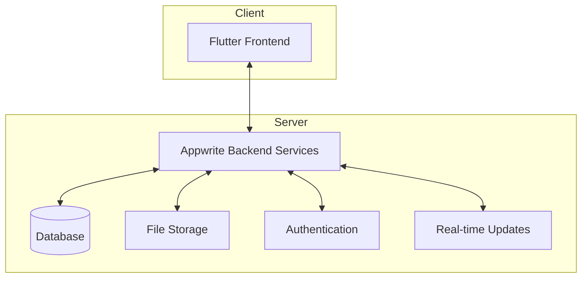

# 2.1 Product Perspective

The Inventory Management Application is designed as a standalone system that can operate independently while offering integration capabilities with other systems as needed. This section describes how the application relates to other products and systems.

## System Architecture

The application follows a client-server architecture with:

1. **Flutter Frontend (Client)**

   - Provides a cross-platform user interface for iOS, Android, and web
   - Handles local state management and UI rendering
   - Implements offline capabilities with local data storage

2. **Appwrite Backend (Server)**
   - Manages authentication and authorization
   - Handles data storage and retrieval
   - Processes business logic and implements API endpoints
   - Manages real-time data synchronization

## User Interfaces

1. **Mobile Application Interface**

   - Native UI components for iOS and Android
   - Responsive design for various screen sizes
   - Offline-capable interface

2. **Web Application Interface**
   - Browser-based interface with responsive design
   - Compatible with major web browsers
   - Progressive Web App (PWA) capabilities

## Hardware Interfaces

The application does not require specific hardware interfaces beyond:

- Standard mobile devices (iOS/Android)
- Desktop/laptop computers for web access
- Optional barcode scanners (can use device camera as alternative)

## Software Interfaces

1. **Operating Systems**

   - iOS 12.0 and above
   - Android 5.0 (API level 21) and above
   - Web browsers: Chrome, Firefox, Safari, Edge (latest 2 major versions)

2. **Appwrite Services**

   - Authentication API
   - Database API
   - Storage API
   - Realtime API

3. **External APIs**
   - Optional integration with payment gateways
   - Optional integration with shipping providers
   - Optional cloud services for enhanced functionality

## Communication Interfaces

1. **Network Protocols**

   - HTTPS for secure API communications
   - WebSockets for real-time data updates
   - REST API for data exchange

2. **Data Formats**
   - JSON for data interchange
   - Base64 for binary data encoding

## Memory and Storage Constraints

- Minimum 100MB of storage space on mobile devices
- Offline storage capacity based on device limitations
- Database storage scales according to business needs

## Operations

The application will support the following operational modes:

1. **Online Mode** - Full functionality with real-time updates
2. **Offline Mode** - Limited functionality with local data storage
3. **Synchronization Mode** - Reconciling local data with server when connectivity is restored
