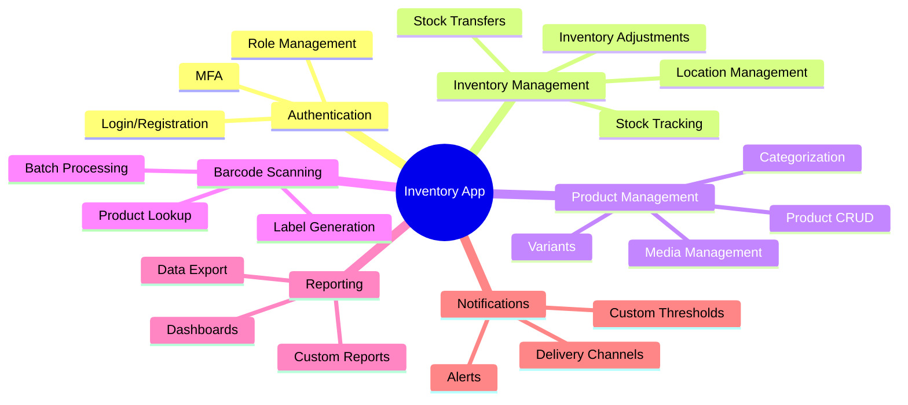

# 2.2 Product Functions

This section provides a summary of the major functions that the Inventory Management Application will perform.

## Core Functionality

## Detailed Functions

### 1. Authentication and User Management

- **User Registration and Authentication**

  - New user registration with email verification
  - Login with email/password
  - Optional social login integration
  - Multi-factor authentication
  - Password recovery process

- **Role-Based Access Control**
  - Predefined user roles (Admin, Manager, Staff, Read-only)
  - Custom permission sets
  - Role assignment and management
  - Access control for sensitive operations

### 2. Inventory Management

- **Stock Tracking**

  - Real-time inventory level monitoring
  - Historical inventory movement tracking
  - Multi-location inventory visibility
  - Unit of measure conversions

- **Inventory Operations**

  - Stock receipts and issues
  - Inventory adjustments with reason codes
  - Stock transfers between locations
  - Batch/lot tracking and management
  - Expiry date tracking

- **Inventory Counts**
  - Scheduled and ad-hoc inventory counts
  - Count sheets generation
  - Variance identification and resolution
  - Count approval workflows

### 3. Product Management

- **Product Information Management**

  - Comprehensive product data storage
  - SKU, UPC, EAN code management
  - Product variants (size, color, etc.)
  - Custom product attributes

- **Product Organization**

  - Hierarchical category management
  - Product tagging and filtering
  - Custom product grouping
  - Product search with advanced filters

- **Product Media Management**
  - Multiple product images
  - Document attachments (manuals, specs)
  - Video support for product demonstrations

### 4. Barcode/QR Code Functionality

- **Scanning Capabilities**

  - Camera-based barcode scanning
  - Support for external barcode scanners
  - Batch scanning mode for bulk operations
  - Multiple barcode format support

- **Label Generation**
  - Custom barcode label design
  - Batch label printing
  - QR code generation with embedded product data

### 5. Reporting and Analytics

- **Dashboard and Visualization**

  - Customizable dashboards
  - Key metrics visualization
  - Interactive charts and graphs
  - Performance indicators

- **Standard Reports**

  - Inventory valuation reports
  - Stock movement reports
  - Product performance analysis
  - Audit trail reports

- **Custom Reporting**
  - Report builder with custom parameters
  - Scheduled report generation
  - Export in multiple formats (PDF, CSV, Excel)
  - Report sharing capabilities

### 6. Notifications and Alerts

- **Inventory Alerts**

  - Low stock level notifications
  - Overstock alerts
  - Expiry date warnings
  - Custom threshold settings

- **System Notifications**

  - User action confirmations
  - Process completion notifications
  - Error alerts and warnings
  - Scheduled task reminders

- **Notification Delivery**
  - In-app notification center
  - Email notifications
  - Optional SMS alerts
  - Push notifications for mobile devices
