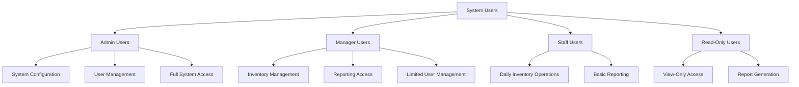

# 2.3 User Characteristics

This section describes the general characteristics of the intended users of the Inventory Management Application, including their technical expertise, experience level, and responsibilities within the system.

## User Categories

### 1. Administrator Users

**Characteristics:**

- Technical proficiency with inventory management systems
- Understanding of system administration concepts
- Responsible for overall system configuration and maintenance
- Typically IT staff or business owners

**Responsibilities:**

- User account management and permission assignment
- System configuration and customization
- Data management and backup procedures
- Setting up operational parameters
- Managing integration with other systems

**Expected Usage:**

- Less frequent but intensive sessions
- Focus on configuration rather than daily operations
- Need access to all system functions and settings

### 2. Manager Users

**Characteristics:**

- Good understanding of business operations and inventory management
- Moderate technical proficiency
- Responsible for department or location oversight
- Typically department heads, store managers, or warehouse supervisors

**Responsibilities:**

- Monitoring inventory levels and movements
- Reviewing and approving inventory operations
- Generating and analyzing reports
- Managing staff user activities
- Setting inventory parameters (reorder points, etc.)

**Expected Usage:**

- Regular usage for monitoring and decision-making
- Focus on reporting and approval processes
- Need access to comprehensive data visualization

### 3. Staff Users

**Characteristics:**

- Basic technical skills for application operation
- Practical knowledge of inventory operations
- Responsible for day-to-day inventory tasks
- Typically warehouse staff, retail employees, or inventory clerks

**Responsibilities:**

- Processing inventory transactions (receipts, issues, transfers)
- Conducting physical inventory counts
- Updating product information
- Basic reporting for daily operations
- Identifying and reporting discrepancies

**Expected Usage:**

- Frequent daily use for operational tasks
- Focus on efficiency and ease of use
- Need streamlined interfaces for common tasks

### 4. Read-Only Users

**Characteristics:**

- Variable technical proficiency
- Need information without operational responsibilities
- Typically auditors, consultants, or executives

**Responsibilities:**

- Viewing inventory status and reports
- Generating custom reports
- Monitoring system performance
- No data modification capabilities

**Expected Usage:**

- Occasional use primarily for information gathering
- Focus on reporting and data visualization
- Need intuitive interfaces with minimal training

## Accessibility Considerations

The application should accommodate users with varying abilities:

- Compliance with WCAG 2.1 Level AA standards
- Support for screen readers
- Adjustable text sizes and contrast options
- Keyboard navigation support
- Minimal reliance on color-based information

## Technical Expertise Assumptions

- Basic familiarity with mobile and web applications
- Understanding of inventory terminology and concepts
- Ability to follow guided workflows
- Comfort with touchscreen interfaces (for mobile users)
- Basic data entry and navigation skills
