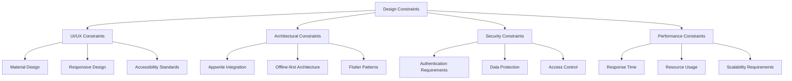

# 2.4 Constraints

This section describes the constraints that will affect the design and implementation of the Inventory Management Application.

## Technical Constraints

### Development Constraints

1. **Frontend Technology**

   - Flutter framework must be used for cross-platform development
   - Must support multiple form factors (phone, tablet, desktop)
   - Must follow Material Design guidelines for UI consistency

2. **Backend Technology**
   - Appwrite must be used as the backend service
   - All data storage must be handled through Appwrite Database
   - Authentication must use Appwrite Authentication service
   - File storage must use Appwrite Storage service

### Hardware Constraints

1. **Mobile Devices**

   - Minimum iOS version: 12.0
   - Minimum Android version: 5.0 (API level 21)
   - Minimum 2GB RAM recommended for optimal performance
   - Minimum 100MB free storage space for application installation

2. **Network Requirements**
   - Internet connection required for initial setup and synchronization
   - Offline functionality must work with limited features
   - Bandwidth usage must be optimized for mobile data connections

## Design Constraints

1. **User Interface Constraints**

   - Must follow established UI patterns for inventory management applications
   - Must be intuitive for users with minimal technical background
   - Must be accessible according to WCAG 2.1 Level AA standards
   - Must support localization and internationalization
   - Must be responsive and adapt to different screen sizes

2. **Architecture Constraints**

   - Must implement clean architecture principles for separation of concerns
   - Must use repository pattern for data access
   - State management must be consistent throughout the application
   - Must implement proper error handling and recovery mechanisms

3. **Security Constraints**
   - Must implement proper authentication and authorization
   - Must secure all API communications using HTTPS
   - Must implement proper data validation on both client and server sides
   - Must handle sensitive data according to relevant data protection regulations
   - Must implement session management and timeout features

## Business Constraints

1. **Time Constraints**

   - Initial release must focus on core functionality (MVP)
   - Phased deployment approach for advanced features

2. **Budget Constraints**

   - Development must utilize open-source tools where possible
   - Third-party services must be evaluated for cost-effectiveness
   - Infrastructure costs must be scalable based on usage

3. **Legal and Regulatory Constraints**

   - Must comply with relevant data protection regulations (GDPR, CCPA, etc.)
   - Must maintain audit trails for sensitive operations
   - Must implement proper data retention and deletion policies
   - Must provide mechanisms for users to export their data

4. **Operational Constraints**
   - Must support backup and restore functionality
   - Must provide system health monitoring
   - Must implement proper logging for troubleshooting
   - Must support seamless updates without data loss
