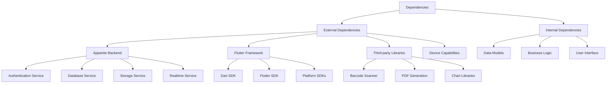

# 2.5 Assumptions and Dependencies

This section outlines the assumptions that have been made during the requirements specification process and the dependencies that affect the development of the Inventory Management Application.

## Assumptions

### Technical Assumptions

1. **User Devices and Environment**

   - Users have access to compatible devices (smartphones, tablets, or computers)
   - Users have intermittent internet connectivity, at minimum
   - Device cameras are available for barcode scanning functionality
   - Users' devices have sufficient storage for offline data caching

2. **Appwrite Backend**

   - Appwrite server is properly configured and maintained
   - Appwrite provides all necessary services for the application (Authentication, Database, Storage, Functions)
   - Appwrite can handle the expected data volume and user concurrency
   - Appwrite will continue to be supported throughout the application lifecycle

3. **Flutter Framework**
   - Flutter provides stable cross-platform compatibility for iOS, Android, and web
   - Flutter packages required by the application are maintained and compatible
   - Flutter's performance is sufficient for the application's requirements

### Business Assumptions

1. **User Capabilities**

   - Users have basic understanding of inventory management concepts
   - Users can follow guided workflows with minimal training
   - Administrative users have technical knowledge to configure the system

2. **Operational Assumptions**
   - The organization has established inventory management processes
   - The organization can provide necessary product data for initial setup
   - The organization has defined roles and responsibilities for system users

## Dependencies

### External Dependencies

1. **Appwrite Services**

   - Dependency on Appwrite Authentication for user management
   - Dependency on Appwrite Database for data storage and retrieval
   - Dependency on Appwrite Storage for file management
   - Dependency on Appwrite Realtime for synchronization
   - Dependency on Appwrite Functions for server-side business logic (if needed)

2. **Flutter Package Dependencies**

   - Flutter SDK and compatible Dart version
   - Appwrite Flutter SDK for backend communication
   - State management libraries (Provider, Bloc, Riverpod, etc.)
   - UI component libraries
   - Barcode scanning libraries
   - Reporting and chart libraries
   - Local storage libraries for offline functionality

3. **System Dependencies**
   - Operating system compatibility (iOS, Android, Web browsers)
   - Camera access for barcode scanning
   - Storage access for local data
   - Network connectivity for synchronization

### Project Dependencies

1. **Development Dependencies**

   - Availability of development environments and tools
   - Access to testing devices for multiple platforms
   - CI/CD infrastructure for automated testing and deployment

2. **Knowledge Dependencies**

   - Flutter and Dart programming expertise
   - Appwrite configuration and management knowledge
   - Inventory management domain expertise

3. **Resource Dependencies**
   - Availability of developers with required skills
   - Availability of testing resources
   - Availability of documentation resources
