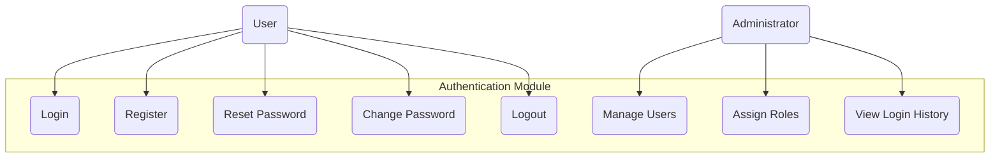

# 3.1 Authentication Module

This section details the requirements for the Authentication Module of the Inventory Management Application, which handles user authentication, authorization, and session management.

## Use Case Diagram

## 3.1.1 User Registration

### Description

The system shall allow new users to create an account with required information. Registration may be self-service or administrator-created depending on organizational policy.

### User Stories

- As a new user, I want to register an account so that I can access the inventory system
- As an administrator, I want to create accounts for employees so that they can access the system with appropriate permissions

### Functional Requirements

#### FR-1.1.1: User Self-Registration

- **Description**: The system shall provide a user interface for self-registration
- **Inputs**:
  - Email address (required, must be valid format)
  - Password (required, must meet strength requirements)
  - Full name (required)
  - Phone number (optional)
  - Department/Location (optional)
- **Process**:
  - Validate input data
  - Check email uniqueness
  - Create user record in Appwrite Authentication
  - Create user profile in database
  - Send verification email
- **Outputs**:
  - Success confirmation with instructions to verify email
  - Error messages for validation failures

#### FR-1.1.2: Email Verification

- **Description**: The system shall verify user email addresses before granting full access
- **Process**:
  - Generate verification token
  - Send email with verification link
  - Verify token when user clicks link
  - Update user account status
- **Outputs**:
  - Confirmation of successful verification
  - Error message for invalid/expired tokens

#### FR-1.1.3: Administrator User Creation

- **Description**: The system shall allow administrators to create new user accounts
- **Inputs**:
  - All user details (as in self-registration)
  - Initial role assignment
  - Account activation status
- **Process**:
  - Create user account
  - Set initial password
  - Assign specified role
  - Configure account status
- **Outputs**:
  - Confirmation of account creation
  - Option to send welcome email

## 3.1.2 User Authentication

### Description

The system shall authenticate users using secure methods and maintain session information appropriately.

### User Stories

- As a registered user, I want to log in securely so that I can access my authorized features
- As a security-conscious user, I want to enable multi-factor authentication to protect my account

### Functional Requirements

#### FR-1.2.1: User Login

- **Description**: The system shall authenticate users with email and password
- **Inputs**:
  - Email address
  - Password
  - Remember me option
- **Process**:
  - Validate credentials against Appwrite Authentication
  - Check account status
  - Create and manage session
  - Log authentication attempt
- **Outputs**:
  - Success: Redirect to dashboard with appropriate permissions
  - Failure: Appropriate error message

#### FR-1.2.2: Multi-Factor Authentication

- **Description**: The system shall support optional two-factor authentication
- **Inputs**:
  - Primary authentication (email/password)
  - Secondary authentication (code from authenticator app or SMS)
- **Process**:
  - Verify secondary authentication code
  - Apply timeout for code entry
- **Outputs**:
  - Success: Complete authentication process
  - Failure: Error message, retry option

#### FR-1.2.3: Session Management

- **Description**: The system shall maintain secure user sessions
- **Requirements**:
  - Automatic session timeout after configurable period of inactivity
  - Option to remember user on trusted devices
  - Ability to view and terminate active sessions
  - Secure session storage

#### FR-1.2.4: Password Recovery

- **Description**: The system shall provide password recovery functionality
- **Inputs**:
  - User email address
- **Process**:
  - Verify email exists in system
  - Generate time-limited recovery token
  - Send recovery email
  - Validate token on access
  - Allow password reset if token valid
- **Outputs**:
  - Success: Password reset confirmation
  - Failure: Appropriate error message

## 3.1.3 Authorization

### Description

The system shall control access to features and data based on user roles and permissions.

### User Stories

- As an administrator, I want to assign roles to users so that they have appropriate access
- As a manager, I want role-based access to ensure my team only accesses relevant features

### Functional Requirements

#### FR-1.3.1: Role-Based Access Control

- **Description**: The system shall implement role-based access control
- **Requirements**:
  - Predefined roles: Administrator, Manager, Staff, Read-Only
  - Custom role creation with specific permission sets
  - Role assignment/revocation by administrators
  - Permission inheritance hierarchy

#### FR-1.3.2: Feature Access Control

- **Description**: The system shall restrict UI elements and API endpoints based on permissions
- **Requirements**:
  - UI adapts to show only accessible features
  - Server-side verification of permissions for all requests
  - Graceful handling of unauthorized access attempts
  - Audit logging of access violations

#### FR-1.3.3: Data Access Control

- **Description**: The system shall restrict data access based on permissions and data ownership
- **Requirements**:
  - Location-based data filtering
  - Department-based data filtering
  - Record-level permissions
  - Enforcement at database query level

## 3.1.4 User Profile Management

### Description

The system shall allow users to view and update their profile information.

### User Stories

- As a user, I want to update my profile information to keep it current
- As a security-conscious user, I want to change my password regularly

### Functional Requirements

#### FR-1.4.1: View User Profile

- **Description**: The system shall allow users to view their profile information
- **Requirements**:
  - Display personal information
  - Display assigned roles and permissions
  - Show account status

#### FR-1.4.2: Update User Profile

- **Description**: The system shall allow users to update their profile information
- **Inputs**:
  - Editable user information
- **Process**:
  - Validate inputs
  - Update user record
  - Log changes
- **Outputs**:
  - Success: Confirmation message
  - Failure: Error message

#### FR-1.4.3: Change Password

- **Description**: The system shall allow users to change their password
- **Inputs**:
  - Current password
  - New password
  - Confirm new password
- **Process**:
  - Verify current password
  - Validate new password strength
  - Update password
  - Log change
- **Outputs**:
  - Success: Confirmation message
  - Failure: Error message

## 3.1.5 Security Requirements

### Description

The system shall implement security best practices for authentication and user management.

### Functional Requirements

#### FR-1.5.1: Password Security

- **Description**: The system shall enforce password security measures
- **Requirements**:
  - Minimum password complexity requirements
  - Password history to prevent reuse
  - Secure storage with hashing and salting (managed by Appwrite)
  - Optional password expiration policy

#### FR-1.5.2: Login Security

- **Description**: The system shall implement login security measures
- **Requirements**:
  - Account lockout after configurable number of failed attempts
  - Unlock workflow via email or administrator
  - CAPTCHA for repeated failed attempts
  - Rate limiting of authentication attempts

#### FR-1.5.3: Security Audit Logging

- **Description**: The system shall log security-related events
- **Requirements**:
  - Log all authentication attempts (success/failure)
  - Log password changes and resets
  - Log role/permission changes
  - Log session creation and termination
  - Timestamps and relevant metadata for all logs
