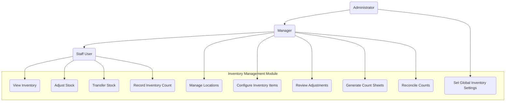

# 3.2 Inventory Management Module

This section details the requirements for the Inventory Management Module, which is the core component responsible for tracking, adjusting, and transferring inventory across locations.

## Use Case Diagram

## 3.2.1 Inventory Tracking

### Description

The system shall maintain accurate records of inventory levels across all locations in real-time, including stock quantity, location, status, and history.

### User Stories

- As an inventory manager, I want to view current stock levels across all locations so I can make informed inventory decisions
- As a staff member, I want to quickly check if an item is in stock at my location so I can assist customers
- As a manager, I want to track inventory history so I can analyze usage patterns and optimize stock levels

### Functional Requirements

#### FR-2.1.1: Inventory Dashboard

- **Description**: The system shall provide a comprehensive dashboard for inventory overview
- **Requirements**:
  - Summary view of total inventory value
  - Stock level indicators (normal, low, out of stock)
  - Quick filters for viewing by location, category, status
  - Recent activity feed for inventory changes
  - Alert indicators for items requiring attention

#### FR-2.1.2: Inventory Search and Filtering

- **Description**: The system shall provide robust search and filtering capabilities
- **Requirements**:
  - Search by product name, SKU, barcode, or description
  - Filter by category, location, stock level, status
  - Sort by various attributes (name, stock level, value)
  - Save frequently used searches/filters
  - Export search results in various formats

#### FR-2.1.3: Real-time Inventory Tracking

- **Description**: The system shall update inventory levels in real-time
- **Requirements**:
  - Automatic updates when transactions affect inventory
  - Live view of current stock levels
  - Real-time synchronization across all devices
  - Historical tracking of inventory changes
  - Timestamps for all inventory movements

#### FR-2.1.4: Inventory Details View

- **Description**: The system shall provide detailed information for each inventory item
- **Requirements**:
  - Current quantity at each location
  - Minimum/maximum stock levels
  - Reorder points and quantities
  - Historical stock movement
  - Average cost and total value
  - Batch/lot information where applicable
  - Expiry dates where applicable

## 3.2.2 Inventory Adjustments

### Description

The system shall enable authorized users to make inventory adjustments with proper documentation and approval workflows.

### User Stories

- As a staff member, I want to record inventory adjustments when discrepancies are found so that the system reflects actual stock levels
- As a manager, I want to review and approve adjustment requests so I can maintain inventory accuracy and prevent unauthorized adjustments
- As an auditor, I want to view the history of inventory adjustments so I can verify proper procedures are being followed

### Functional Requirements

#### FR-2.2.1: Stock Adjustment Creation

- **Description**: The system shall allow users to create stock adjustment records
- **Inputs**:
  - Product selection
  - Current quantity (displayed automatically)
  - New quantity or adjustment amount
  - Reason code (from predefined list)
  - Notes/comments
  - Supporting documentation (optional attachments)
  - Location
- **Process**:
  - Calculate adjustment quantity
  - Validate against business rules
  - Route for approval if needed
  - Update inventory if no approval required
- **Outputs**:
  - Confirmation of adjustment request
  - Notification to approvers if applicable

#### FR-2.2.2: Adjustment Approval Workflow

- **Description**: The system shall implement an approval workflow for adjustments exceeding thresholds
- **Requirements**:
  - Configurable approval thresholds based on quantity or value
  - Multiple approval levels based on threshold
  - Notification to approvers
  - Ability to approve/reject with comments
  - Automatic updates upon approval

#### FR-2.2.3: Adjustment Reason Codes

- **Description**: The system shall maintain configurable reason codes for adjustments
- **Requirements**:
  - Administrator-configurable reason codes
  - Required selection for all adjustments
  - Reporting by reason code
  - Different approval rules by reason code

#### FR-2.2.4: Adjustment History and Audit Trail

- **Description**: The system shall maintain detailed history of all adjustments
- **Requirements**:
  - Record of all adjustments with timestamps
  - User identification for each action
  - Before and after quantities
  - Reason codes and comments
  - Approval history if applicable
  - Non-editable audit trail

## 3.2.3 Stock Transfers

### Description

The system shall enable movement of inventory between locations with proper tracking and verification.

### User Stories

- As a staff member, I want to initiate stock transfers between locations so I can balance inventory across the organization
- As a receiving location manager, I want to verify incoming transfers so I can confirm receipt of all items
- As an inventory manager, I want to track in-transit inventory so I know where all my stock is located

### Functional Requirements

#### FR-2.3.1: Transfer Initiation

- **Description**: The system shall allow users to create stock transfer requests
- **Inputs**:
  - Source location
  - Destination location
  - Products and quantities
  - Requested delivery date
  - Transfer reason/notes
- **Process**:
  - Validate stock availability
  - Create transfer record
  - Reserve inventory at source
  - Route for approval if needed
- **Outputs**:
  - Transfer request confirmation
  - Notifications to source and destination locations

#### FR-2.3.2: Transfer Status Tracking

- **Description**: The system shall track the status of transfers throughout the process
- **Requirements**:
  - Status tracking (Requested, Approved, In Progress, In Transit, Delivered, Verified)
  - Status update timestamps
  - User tracking for each status change
  - Estimated and actual delivery dates
  - Comments at each stage

#### FR-2.3.3: Transfer Receipt and Verification

- **Description**: The system shall allow destination locations to verify received transfers
- **Inputs**:
  - Transfer reference
  - Received quantities (may differ from shipped)
  - Receipt condition notes
  - Discrepancy documentation
- **Process**:
  - Compare received vs. shipped quantities
  - Flag discrepancies
  - Update inventory at destination
  - Close transfer or initiate discrepancy resolution
- **Outputs**:
  - Receipt confirmation
  - Discrepancy reports if applicable
  - Notifications to relevant parties

#### FR-2.3.4: Transfer History

- **Description**: The system shall maintain a comprehensive history of all transfers
- **Requirements**:
  - Complete transfer details
  - Status change history
  - User actions at each stage
  - Resolution of any discrepancies
  - Searchable transfer history

## 3.2.4 Inventory Counts

### Description

The system shall support scheduled and ad-hoc physical inventory counts with tools for reconciliation.

### User Stories

- As an inventory manager, I want to schedule regular inventory counts so I can verify system accuracy
- As a staff member, I want an efficient way to record physical counts so I can complete the task quickly and accurately
- As a manager, I want to easily identify and resolve count discrepancies so I can maintain inventory accuracy

### Functional Requirements

#### FR-2.4.1: Count Sheet Generation

- **Description**: The system shall generate count sheets for physical inventory counts
- **Requirements**:
  - Filter by location, category, or other criteria
  - Scheduled or ad-hoc count sheet creation
  - Configurable count sheet layouts
  - Option to include or exclude current quantities
  - Barcode or QR code for quick scanning
  - Digital and printable formats

#### FR-2.4.2: Count Recording

- **Description**: The system shall provide efficient methods to record physical counts
- **Requirements**:
  - Mobile-friendly count interface
  - Barcode scanning capability
  - Offline counting capability with synchronization
  - Batch count entry option
  - Photo documentation of issues
  - Comments and notes field
  - Multiple counter support for the same count

#### FR-2.4.3: Count Reconciliation

- **Description**: The system shall support reconciliation of counts with system quantities
- **Requirements**:
  - Automatic identification of discrepancies
  - Variance calculation and reporting
  - Threshold-based flagging of significant variances
  - Adjustment recommendation generation
  - Approval workflow for reconciliation
  - Batch processing of minor variances

#### FR-2.4.4: Count History and Reporting

- **Description**: The system shall maintain history of all counts and provide reporting
- **Requirements**:
  - Count accuracy metrics
  - Historical variance analysis
  - Trend identification
  - User performance metrics
  - Location accuracy comparison
  - Cost of variance reporting

## 3.2.5 Location Management

### Description

The system shall support management of multiple inventory locations with appropriate hierarchy and properties.

### User Stories

- As an administrator, I want to set up multiple inventory locations so I can track inventory across the organization
- As a manager, I want to configure location-specific settings so I can accommodate different operational needs
- As an inventory planner, I want to define relationships between locations so I can automate stock balancing

### Functional Requirements

#### FR-2.5.1: Location Setup and Configuration

- **Description**: The system shall allow creation and management of inventory locations
- **Requirements**:
  - Location creation with detailed properties
  - Location hierarchy (parent-child relationships)
  - Location types (warehouse, retail, virtual, etc.)
  - Location status management (active, inactive, temporary)
  - Location-specific settings and parameters

#### FR-2.5.2: Location-specific Rules

- **Description**: The system shall support location-specific inventory rules
- **Requirements**:
  - Location-specific reorder points
  - Location-specific minimum/maximum stock levels
  - Location-specific approval workflows
  - Stock allocation rules by location
  - Transfer rules between locations

#### FR-2.5.3: Location Analytics

- **Description**: The system shall provide analytics for inventory locations
- **Requirements**:
  - Location utilization metrics
  - Inventory turnover by location
  - Location capacity management
  - Location performance comparisons
  - Activity volume by location
