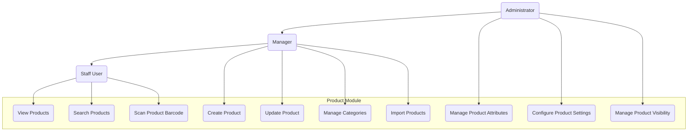

# 3.3 Product Module

This section details the requirements for the Product Module, which manages all product-related information, categories, and attributes in the Inventory Management Application.

## Use Case Diagram

## 3.3.1 Product Information Management

### Description

The system shall provide comprehensive capabilities for creating, viewing, updating, and managing product information.

### User Stories

- As a product manager, I want to add new products with detailed information so that inventory can be tracked accurately
- As a staff member, I want to quickly find and view product details so I can answer customer queries
- As an inventory manager, I want to update product information when specifications change

### Functional Requirements

#### FR-3.1.1: Product Creation

- **Description**: The system shall allow authorized users to create new products
- **Inputs**:
  - Basic information (name, description, notes)
  - Identification (SKU, UPC/EAN, manufacturer part number)
  - Classification (categories, tags, attributes)
  - Inventory parameters (reorder points, min/max levels)
  - Physical attributes (dimensions, weight)
  - Media (images, documents)
  - Custom attributes
- **Process**:
  - Validate required fields
  - Check for duplicate product identifiers
  - Create product record
  - Initialize inventory records if specified
- **Outputs**:
  - Confirmation of product creation
  - Product detail view
  - Option to add inventory

#### FR-3.1.2: Product Details View

- **Description**: The system shall provide a comprehensive view of product information
- **Requirements**:
  - All product attributes and specifications
  - Inventory status across locations
  - Stock level indicators
  - Price and cost information
  - Product images and attachments
  - Product history (creation, modifications)
  - Related products
  - Custom fields based on product type

#### FR-3.1.3: Product Editing

- **Description**: The system shall allow authorized users to update product information
- **Requirements**:
  - Field-level editing permissions
  - Batch editing for multiple products
  - Change history tracking
  - Approvals for critical field changes if configured
  - Option to update related products

#### FR-3.1.4: Product Search and Filtering

- **Description**: The system shall provide advanced search capabilities for products
- **Requirements**:
  - Full-text search across product fields
  - Filtering by category, status, location
  - Filtering by inventory levels
  - Barcode/SKU direct lookup
  - Saved searches
  - Customizable results display
  - Export search results

## 3.3.2 Product Categorization

### Description

The system shall provide capabilities to organize products into hierarchical categories and apply attributes based on categorization.

### User Stories

- As a product manager, I want to organize products into categories so they can be easily found
- As an administrator, I want to define category-specific attributes so relevant information is captured for each product type
- As a staff member, I want to filter products by category so I can find what I need quickly

### Functional Requirements

#### FR-3.2.1: Category Management

- **Description**: The system shall provide tools to manage product categories
- **Requirements**:
  - Create, edit, and delete categories
  - Hierarchical category structure (parent-child)
  - Category attributes and metadata
  - Category visibility settings
  - Category image/icon assignment
  - Bulk category assignment
  - Category status (active/inactive)

#### FR-3.2.2: Category Hierarchy View

- **Description**: The system shall display the category structure in an intuitive manner
- **Requirements**:
  - Tree view of category hierarchy
  - Expandable/collapsible nodes
  - Drag-and-drop reorganization
  - Product counts by category
  - Search within categories

#### FR-3.2.3: Category-based Attributes

- **Description**: The system shall support category-specific product attributes
- **Requirements**:
  - Define attributes at category level
  - Inherit attributes from parent categories
  - Override inherited attributes
  - Required vs. optional attributes
  - Default values by category
  - Attribute validation rules

## 3.3.3 Product Variants

### Description

The system shall support management of product variants such as different sizes, colors, or styles of the same base product.

### User Stories

- As a product manager, I want to create product variants to represent different versions of the same product
- As an inventory manager, I want to track inventory for each product variant separately
- As a staff member, I want to easily find variants of a product when checking availability

### Functional Requirements

#### FR-3.3.1: Variant Creation and Management

- **Description**: The system shall allow creation and management of product variants
- **Requirements**:
  - Create parent-child relationships between products
  - Define variant attributes (size, color, material, etc.)
  - Generate variant combinations automatically
  - Bulk creation of variants
  - Variant-specific details and images
  - Independent inventory tracking for variants
  - Variant status management

#### FR-3.3.2: Variant Matrix View

- **Description**: The system shall provide a matrix view for managing variants
- **Requirements**:
  - Grid display of variants by attributes
  - Batch edit capabilities
  - Inventory level indicators
  - Quick navigation between variants
  - Filtering and sorting options

#### FR-3.3.3: Variant Relationships

- **Description**: The system shall maintain relationships between variant products
- **Requirements**:
  - Display related variants on product detail
  - Navigate between variants easily
  - Copy attributes between variants
  - Bulk operations on variant groups
  - Synchronize shared attributes

## 3.3.4 Product Media Management

### Description

The system shall support management of product images and documents to provide visual and detailed information about products.

### User Stories

- As a product manager, I want to upload multiple images for each product to show its features
- As a staff member, I want to view product images to identify items quickly
- As a manager, I want to attach specification documents to products for reference

### Functional Requirements

#### FR-3.4.1: Media Upload and Management

- **Description**: The system shall provide capabilities to manage product media
- **Requirements**:
  - Multiple image upload
  - Document attachment (PDF, docs, spreadsheets)
  - Media categorization
  - Drag-and-drop interface
  - Image cropping and basic editing
  - Automatic thumbnail generation
  - Media metadata management

#### FR-3.4.2: Media Display

- **Description**: The system shall display product media appropriately
- **Requirements**:
  - Image gallery with thumbnails
  - Primary image designation
  - Zoom capability for images
  - Preview for documents
  - Mobile-optimized media display
  - Media sorting options

#### FR-3.4.3: Media Storage and Performance

- **Description**: The system shall efficiently store and deliver product media
- **Requirements**:
  - Automatic image optimization
  - Responsive image delivery
  - Caching for performance
  - Storage optimization
  - Backup for media files
  - Format conversion as needed

## 3.3.5 Product Import/Export

### Description

The system shall provide capabilities to bulk import and export product data to facilitate setup and data exchange.

### User Stories

- As an administrator, I want to import product data from a spreadsheet to quickly set up the system
- As a manager, I want to export product data for reporting and analysis
- As a product manager, I want to update multiple products at once through import

### Functional Requirements

#### FR-3.5.1: Product Import

- **Description**: The system shall support importing product data from external sources
- **Requirements**:
  - Support for CSV, Excel formats
  - Field mapping interface
  - Validation before import
  - Error handling and reporting
  - Duplicate handling options
  - Import templates
  - Scheduled/automatic imports
  - Transaction logging

#### FR-3.5.2: Product Export

- **Description**: The system shall support exporting product data
- **Requirements**:
  - Multiple export formats (CSV, Excel, PDF)
  - Field selection for export
  - Filtering options for export
  - Saved export configurations
  - Scheduled exports
  - Large dataset handling

#### FR-3.5.3: Data Transformation

- **Description**: The system shall provide data transformation capabilities for import/export
- **Requirements**:
  - Field mapping and transformation
  - Default value handling
  - Data validation rules
  - Format conversion
  - Handling of special characters

## 3.3.6 Product Barcodes and Identifiers

### Description

The system shall manage product identification through barcodes and other identifier systems.

### User Stories

- As a staff member, I want to scan product barcodes to quickly identify items
- As a product manager, I want to assign unique identifiers to products for tracking
- As an inventory manager, I want to print barcode labels for products

### Functional Requirements

#### FR-3.6.1: Barcode Management

- **Description**: The system shall support product barcode management
- **Requirements**:
  - Support for multiple barcode formats (UPC, EAN, Code128, QR, etc.)
  - Automatic barcode generation
  - Manual barcode entry
  - Barcode verification
  - Multiple barcodes per product
  - Primary barcode designation

#### FR-3.6.2: Product Identification

- **Description**: The system shall support multiple product identification methods
- **Requirements**:
  - Internal SKU generation
  - Manufacturer part number tracking
  - Alternative identifier support
  - Serial number tracking
  - Batch/lot number support
  - ID validation rules

#### FR-3.6.3: Barcode Label Generation

- **Description**: The system shall support barcode label generation
- **Requirements**:
  - Customizable label templates
  - Batch label printing
  - Label size configuration
  - Include product details on label
  - Preview before printing
  - PDF generation for external printing
