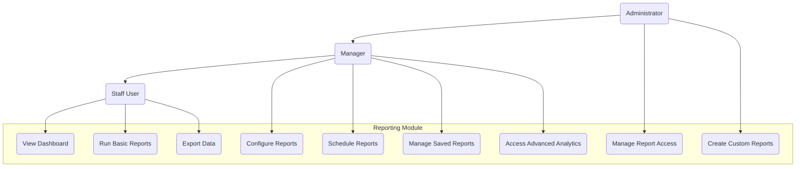

# 3.4 Reporting Module

This section details the requirements for the Reporting Module, which provides analytics, insights, and exportable reports for the Inventory Management Application.

## Use Case Diagram

## 3.4.1 Dashboards

### Description

The system shall provide configurable dashboards with visual representations of key inventory metrics, allowing users to monitor performance at a glance.

### User Stories

- As a manager, I want a dashboard showing key inventory metrics so I can quickly assess operations
- As a staff member, I want to see my location's inventory status to prioritize my daily tasks
- As an executive, I want high-level performance indicators to monitor business health

### Functional Requirements

#### FR-4.1.1: Dashboard Configuration

- **Description**: The system shall allow users to configure personalized dashboards
- **Requirements**:
  - Multiple dashboard support (system default and user-defined)
  - Widget selection from predefined components
  - Widget placement and sizing
  - Dashboard sharing options
  - Role-based dashboard templates
  - Auto-refresh settings
  - Mobile-friendly layouts

#### FR-4.1.2: Dashboard Widgets

- **Description**: The system shall provide various widgets for dashboard display
- **Requirements**:
  - Inventory level indicators
  - Low stock alerts
  - Inventory value summaries
  - Recent activity feeds
  - Trend charts (daily, weekly, monthly)
  - Performance metrics
  - Top/bottom performing products
  - Quick access to common tasks

#### FR-4.1.3: Interactive Dashboard Elements

- **Description**: The system shall support interactive dashboard elements
- **Requirements**:
  - Drill-down capabilities from summary to detail
  - Filtering options within widgets
  - Date range selectors
  - Location/category filters
  - Click-through to full reports
  - Real-time data updates
  - Expandable widget view

## 3.4.2 Standard Reports

### Description

The system shall provide a set of predefined standard reports covering key inventory operations and metrics.

### User Stories

- As a manager, I want to run inventory valuation reports to track asset value
- As an inventory specialist, I want to generate stock movement reports to analyze inventory flow
- As an administrator, I want to access system usage reports to monitor user activity

### Functional Requirements

#### FR-4.2.1: Inventory Status Reports

- **Description**: The system shall provide reports on current inventory status
- **Report Types**:
  - Current inventory levels by location
  - Low stock items report
  - Excess inventory report
  - Inventory valuation report
  - Reorder recommendation report
  - Inventory aging report
  - Inventory turnover report

#### FR-4.2.2: Inventory Movement Reports

- **Description**: The system shall provide reports on inventory movements
- **Report Types**:
  - Stock movement history
  - Adjustment summary report
  - Transfer history report
  - Receiving report
  - Inventory count variance report
  - Product utilization report
  - Batch/lot tracking report

#### FR-4.2.3: Operational Reports

- **Description**: The system shall provide reports on operational activities
- **Report Types**:
  - User activity report
  - System usage statistics
  - Action audit trail
  - Approval status report
  - Task completion report
  - Error and exception report

## 3.4.3 Report Generation

### Description

The system shall provide flexible tools for users to generate, customize, and export reports.

### User Stories

- As a manager, I want to customize report parameters to focus on specific data points
- As an analyst, I want to save report configurations for future use
- As an administrator, I want to schedule automated reports for regular distribution

### Functional Requirements

#### FR-4.3.1: Report Parameters and Filters

- **Description**: The system shall provide comprehensive filtering options for reports
- **Requirements**:
  - Date range selection
  - Location/category filters
  - Product/user filters
  - Status filters
  - Value range filters
  - Comparison periods
  - Inclusion/exclusion criteria
  - Parameter validation

#### FR-4.3.2: Report Customization

- **Description**: The system shall allow customization of report outputs
- **Requirements**:
  - Column selection and ordering
  - Sorting options
  - Grouping and subtotals
  - Summarization options
  - Display formatting
  - Custom headers/footers
  - Company branding options
  - Page layout configuration

#### FR-4.3.3: Report Scheduling

- **Description**: The system shall support scheduling of automated reports
- **Requirements**:
  - Recurrence settings (daily, weekly, monthly)
  - Distribution list management
  - Delivery method options (email, in-app, download)
  - Format selection for delivery
  - Dynamic parameter handling
  - Schedule management interface
  - Execution history and logs

## 3.4.4 Data Export and Integration

### Description

The system shall provide capabilities to export data in various formats and integrate with external analytics tools.

### User Stories

- As a financial analyst, I want to export inventory data to our accounting system
- As a data analyst, I want to download raw data for custom analysis in external tools
- As an IT administrator, I want to integrate our BI tools with the inventory system

### Functional Requirements

#### FR-4.4.1: Export Formats

- **Description**: The system shall support multiple export formats
- **Requirements**:
  - PDF format for presentation and printing
  - Excel format for data manipulation
  - CSV format for raw data
  - HTML format for web viewing
  - JSON format for data integration
  - XML format for structured data exchange
  - Format-specific optimizations

#### FR-4.4.2: Bulk Data Export

- **Description**: The system shall support bulk data export capabilities
- **Requirements**:
  - Large dataset handling
  - Background processing for large exports
  - Progress indicators
  - Chunked downloads
  - Compression options
  - Automated cleanup of temporary files
  - Export history and management

#### FR-4.4.3: External System Integration

- **Description**: The system shall provide capabilities to integrate with external analytics systems
- **Requirements**:
  - API access for data extraction
  - Webhook support for event-driven integrations
  - Scheduled data synchronization
  - Authentication for external systems
  - Data transformation options
  - Logging of external access
  - Rate limiting and throttling controls

## 3.4.5 Custom Reports and Analytics

### Description

The system shall provide tools for creating custom reports and performing advanced analytics on inventory data.

### User Stories

- As an inventory manager, I want to create custom reports specific to my business needs
- As an analyst, I want to perform trend analysis on inventory movements
- As an executive, I want predictive analytics to forecast inventory needs

### Functional Requirements

#### FR-4.5.1: Custom Report Designer

- **Description**: The system shall provide a tool for creating custom reports
- **Requirements**:
  - Visual report designer interface
  - Field selection from data model
  - Formula and calculation creation
  - Custom grouping and summarization
  - Visual element inclusion (charts, tables)
  - Template creation and management
  - Testing and preview capabilities

#### FR-4.5.2: Advanced Analytics

- **Description**: The system shall provide advanced analytics capabilities
- **Requirements**:
  - Trend analysis tools
  - Comparative analysis
  - Statistical functions
  - Forecasting capabilities
  - Anomaly detection
  - Performance benchmarking
  - What-if scenario modeling

#### FR-4.5.3: Data Visualization

- **Description**: The system shall provide rich data visualization tools
- **Requirements**:
  - Multiple chart types (line, bar, pie, etc.)
  - Interactive visualizations
  - Custom color schemes and styling
  - Combination visualizations
  - Annotation capabilities
  - Responsive design for different screen sizes
  - Export of visualizations
