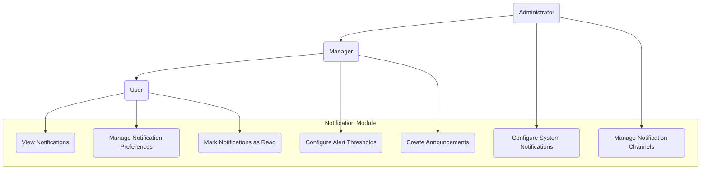

# 3.5 Notification Module

This section details the requirements for the Notification Module, which manages alerts, messages, and communication related to inventory events and system activities.

## Use Case Diagram

## 3.5.1 Inventory Alert Notifications

### Description

The system shall generate and deliver notifications based on inventory status and predefined thresholds.

### User Stories

- As an inventory manager, I want to receive alerts when stock falls below reorder points so I can take action
- As a manager, I want to be notified about excessive inventory so I can optimize stock levels
- As a quality control manager, I want to receive alerts for approaching expiry dates so I can prevent waste

### Functional Requirements

#### FR-5.1.1: Low Stock Alerts

- **Description**: The system shall generate alerts when stock levels fall below defined thresholds
- **Requirements**:
  - Configurable threshold levels (absolute quantity or percentage)
  - Location-specific thresholds
  - Product-specific thresholds
  - Categorization of alert severity
  - Link to reorder or transfer workflows
  - Aggregation options for multiple items
  - Snooze/dismiss options

#### FR-5.1.2: Stock Expiry Alerts

- **Description**: The system shall generate alerts for inventory approaching expiration dates
- **Requirements**:
  - Configurable time thresholds before expiry
  - Multiple notification points (30-days, 7-days, etc.)
  - Batch/lot specific tracking
  - Prioritization by quantity and value
  - Recommendations for stock rotation
  - Integration with inventory adjustment workflows

#### FR-5.1.3: Excessive Inventory Alerts

- **Description**: The system shall generate alerts when inventory exceeds maximum thresholds
- **Requirements**:
  - Configurable maximum level thresholds
  - Duration-based triggers (stock above level for X days)
  - Value-based assessment
  - Slow-moving inventory identification
  - Recommendations for stock reallocation
  - Seasonal adjustment considerations

## 3.5.2 Operational Notifications

### Description

The system shall generate notifications related to operational activities requiring attention or action.

### User Stories

- As a manager, I want to be notified when inventory adjustments require approval so I can review them promptly
- As a receiving manager, I want to be alerted when transfers are initiated to my location so I can prepare
- As an inventory specialist, I want to be reminded of scheduled inventory counts so I don't miss them

### Functional Requirements

#### FR-5.2.1: Approval Request Notifications

- **Description**: The system shall notify relevant users about pending approvals
- **Requirements**:
  - Immediate notification on request submission
  - Summary of items requiring approval
  - Priority indicators
  - Age tracking for pending approvals
  - Escalation for overdue approvals
  - Direct link to approval workflow
  - Delegation options during absence

#### FR-5.2.2: Task Assignment Notifications

- **Description**: The system shall notify users about assigned tasks
- **Requirements**:
  - Notification on task assignment
  - Due date and priority information
  - Task details and instructions
  - Accept/decline options
  - Progress tracking reminders
  - Overdue task escalation
  - Completion confirmation request

#### FR-5.2.3: Schedule Reminders

- **Description**: The system shall provide reminders for scheduled inventory activities
- **Requirements**:
  - Configurable reminder schedule
  - Multiple reminder points (1 week before, 1 day before, etc.)
  - Calendar integration options
  - Preparation checklist inclusion
  - Team notification options
  - Confirmation of readiness request
  - Rescheduling workflow integration

## 3.5.3 System Notifications

### Description

The system shall provide notifications regarding system status, updates, and technical issues.

### User Stories

- As an administrator, I want to be alerted about system errors so I can address them quickly
- As a user, I want to be notified about planned maintenance so I can plan my work accordingly
- As a manager, I want to know when data synchronization issues occur so I can verify information accuracy

### Functional Requirements

#### FR-5.3.1: Technical Alert Notifications

- **Description**: The system shall notify relevant users about technical issues
- **Requirements**:
  - Error categorization by severity
  - Appropriate routing based on error type
  - Detailed diagnostic information for technical users
  - Simplified messaging for end users
  - Resolution status updates
  - Recovery confirmation messages
  - Follow-up verification requests

#### FR-5.3.2: Maintenance Notifications

- **Description**: The system shall provide notifications about system maintenance
- **Requirements**:
  - Advance notice of scheduled maintenance
  - Impact assessment information
  - Duration estimates
  - Alternative procedure suggestions
  - Progress updates during maintenance
  - Completion notifications
  - Post-maintenance verification requests

#### FR-5.3.3: Data Synchronization Alerts

- **Description**: The system shall alert users to data synchronization issues
- **Requirements**:
  - Real-time sync failure notifications
  - Affected data identification
  - Last successful sync information
  - Manual reconciliation instructions
  - Retry mechanism notifications
  - Resolution confirmation
  - Data validation suggestions

## 3.5.4 Notification Management

### Description

The system shall provide capabilities for users to manage their notification preferences and view notification history.

### User Stories

- As a user, I want to customize my notification preferences so I only receive relevant alerts
- As a manager, I want to view notification history for my team to ensure they're receiving important information
- As an administrator, I want to configure system-wide notification settings to ensure efficient communication

### Functional Requirements

#### FR-5.4.1: Notification Preferences

- **Description**: The system shall allow users to configure notification preferences
- **Requirements**:
  - Notification type subscription options
  - Delivery channel selection (in-app, email, mobile push)
  - Frequency settings (immediate, digest, summary)
  - Quiet hours configuration
  - Priority threshold settings
  - Temporary suspension options
  - Role-based default preferences

#### FR-5.4.2: Notification Center

- **Description**: The system shall provide a central location for viewing notifications
- **Requirements**:
  - Unified notification inbox
  - Read/unread status tracking
  - Sorting and filtering options
  - Bulk action support (mark read, delete)
  - Search functionality
  - Retention period configuration
  - Archiving capabilities

#### FR-5.4.3: Notification History

- **Description**: The system shall maintain a history of notifications
- **Requirements**:
  - Complete notification history log
  - Delivery status tracking
  - User interaction tracking (read, clicked)
  - Notification effectiveness metrics
  - Historical pattern analysis
  - Compliance audit support
  - Archiving and cleanup policies

## 3.5.5 Notification Channels

### Description

The system shall support multiple channels for notification delivery to ensure timely communication.

### User Stories

- As a mobile user, I want to receive push notifications on my device for critical alerts
- As a manager, I want important notifications delivered to my email when I'm away from the system
- As an administrator, I want to configure which notification types use which delivery channels

### Functional Requirements

#### FR-5.5.1: In-App Notifications

- **Description**: The system shall deliver notifications within the application interface
- **Requirements**:
  - Real-time notification display
  - Notification counter and indicators
  - Toast/popup for critical notifications
  - Interactive notification elements
  - Persistence across sessions
  - Clear visual hierarchy by importance
  - Responsive design across device types

#### FR-5.5.2: Email Notifications

- **Description**: The system shall send notifications via email
- **Requirements**:
  - Branded email templates
  - Plain text alternatives
  - Proper threading for related notifications
  - Click-through authentication
  - Unsubscribe/preference management links
  - Delivery tracking
  - Attachment support for reports

#### FR-5.5.3: Mobile Push Notifications

- **Description**: The system shall send push notifications to mobile devices
- **Requirements**:
  - Integration with mobile app notifications
  - Configurable alert sounds
  - Condensed content for preview
  - Direct deep linking to relevant screens
  - Badge count management
  - Critical alerts bypass (for DND mode)
  - Offline queuing mechanism
