# 3.6 User Management Module

This section details the requirements for the User Management Module, which handles administration of users, roles, and permissions beyond basic authentication functionality.

## Use Case Diagram

```mermaid
graph TD
    Admin(Administrator) --> CreateUsers(Create Users)
    Admin --> ManageRoles(Manage Roles)
    Admin --> AssignPermissions(Assign Permissions)
    Admin --> ManageUserGroups(Manage User Groups)
    Admin --> ViewAuditLogs(View Audit Logs)
    Admin --> ConfigureSettings(Configure User Settings)

    Manager(Manager) --> ViewTeamMembers(View Team Members)
    Manager --> AssignTasks(Assign Tasks)
    Manager --> MonitorActivity(Monitor User Activity)

    User(User) --> ViewProfile(View Profile)
    User --> UpdateProfile(Update Profile)
    User --> ViewTeam(View Team)
    User --> TrackActivity(Track Own Activity)

    subgraph User Management Module
    CreateUsers
    ManageRoles
    AssignPermissions
    ManageUserGroups
    ViewAuditLogs
    ConfigureSettings
    ViewTeamMembers
    AssignTasks
    MonitorActivity
    ViewProfile
    UpdateProfile
    ViewTeam
    TrackActivity
    end
```

## 3.6.1 User Administration

### Description

The system shall provide capabilities for administrators to manage users beyond the basic registration and authentication processes.

### User Stories

- As an administrator, I want to create and manage user accounts so I can control system access
- As a manager, I want to view and manage my team members to assign responsibilities
- As an administrator, I want to activate or deactivate users when their employment status changes

### Functional Requirements

#### FR-6.1.1: User Account Management

- **Description**: The system shall allow administrators to manage user accounts
- **Requirements**:
  - Create users manually (bypass self-registration)
  - Edit user information and profile details
  - View user status and activity history
  - Reset passwords on behalf of users
  - Lock/unlock user accounts
  - Enable/disable multi-factor authentication
  - Bulk user import from CSV/Excel
  - User account archiving and deletion

#### FR-6.1.2: User Status Management

- **Description**: The system shall support different user statuses
- **Requirements**:
  - Active status for current users
  - Inactive status for temporary suspension
  - Pending status for unverified accounts
  - Archived status for historical records
  - Status change history tracking
  - Automatic status transitions based on rules
  - Status-based access restrictions

#### FR-6.1.3: User Directory

- **Description**: The system shall provide a searchable directory of users
- **Requirements**:
  - List view with filtering options
  - Search by name, email, role, department
  - Sort by various attributes
  - Detailed user profile view
  - Export user list functionality
  - User metrics and statistics
  - Organization chart view (hierarchical)

## 3.6.2 Role and Permission Management

### Description

The system shall provide capabilities to define roles with associated permissions and assign them to users.

### User Stories

- As an administrator, I want to create custom roles so I can align system access with organizational responsibilities
- As a security officer, I want to control granular permissions to ensure proper data access
- As a manager, I want to assign roles to team members based on their job functions

### Functional Requirements

#### FR-6.2.1: Role Management

- **Description**: The system shall allow creation and management of user roles
- **Requirements**:
  - Create, edit, and delete roles
  - Role inheritance hierarchy
  - Role descriptions and metadata
  - Role templates for common job functions
  - Role assignment history
  - Role validity periods
  - Role conflict prevention

#### FR-6.2.2: Permission Management

- **Description**: The system shall provide granular permission control
- **Requirements**:
  - Feature-level permissions
  - Data-level permissions
  - Location-based permissions
  - Operation-specific permissions (view, create, edit, delete)
  - Permission grouping for easier management
  - Permission dependency handling
  - Permission conflict resolution

#### FR-6.2.3: Role Assignment

- **Description**: The system shall support assigning roles to users
- **Requirements**:
  - Multiple role assignment per user
  - Temporary role assignments
  - Role assignment delegation (to managers)
  - Role assignment approval workflow
  - Bulk role assignment
  - Role assignment notifications
  - Role assignment audit trail

## 3.6.3 User Groups and Teams

### Description

The system shall support organizing users into groups and teams for easier management and collaboration.

### User Stories

- As an administrator, I want to organize users into groups so I can manage permissions efficiently
- As a manager, I want to create teams for specific projects or locations
- As a user, I want to see my team members to facilitate collaboration

### Functional Requirements

#### FR-6.3.1: Group Management

- **Description**: The system shall support the creation and management of user groups
- **Requirements**:
  - Create, edit, and delete groups
  - Add/remove users to/from groups
  - Group hierarchies and nesting
  - Group-based permission assignment
  - Dynamic groups based on criteria
  - Group metadata and descriptions
  - Group visibility settings

#### FR-6.3.2: Team Management

- **Description**: The system shall support team structures for operational purposes
- **Requirements**:
  - Team creation and configuration
  - Team member assignment
  - Team leader designation
  - Team-specific settings and preferences
  - Team communication channels
  - Team performance metrics
  - Cross-team collaboration features

#### FR-6.3.3: Organizational Structure

- **Description**: The system shall represent organizational hierarchy
- **Requirements**:
  - Department/division structure
  - Reporting relationships
  - Hierarchical visualization
  - Location-based organization
  - Matrix organization support
  - Organization change history
  - Impact analysis for structural changes

## 3.6.4 User Activity and Audit

### Description

The system shall track and provide visibility into user activities for audit and performance monitoring purposes.

### User Stories

- As an administrator, I want to view user activity logs to ensure compliance
- As a manager, I want to monitor team productivity through activity metrics
- As a security officer, I want to investigate suspicious activities through audit trails

### Functional Requirements

#### FR-6.4.1: User Activity Tracking

- **Description**: The system shall track user activities within the application
- **Requirements**:
  - Login/logout tracking
  - Feature usage statistics
  - Time spent in different areas
  - Transaction volumes by user
  - Productivity metrics
  - Activity trends over time
  - Anomaly detection in usage patterns

#### FR-6.4.2: Activity Reporting

- **Description**: The system shall provide reports on user activities
- **Requirements**:
  - Individual user activity reports
  - Team/group activity summaries
  - Comparative performance metrics
  - Activity heat maps (time/feature)
  - Export and sharing options
  - Scheduled activity reports
  - Custom reporting periods

#### FR-6.4.3: Security Audit Trail

- **Description**: The system shall maintain a comprehensive security audit trail
- **Requirements**:
  - Security-relevant action logging
  - Access attempt tracking (success/failure)
  - Permission changes logging
  - Data access and modification logs
  - System setting changes
  - Tamper-evident logging
  - Log retention policies

## 3.6.5 User Settings and Preferences

### Description

The system shall allow customization of user settings and preferences at individual, group, and system levels.

### User Stories

- As a user, I want to customize my application preferences for a better experience
- As a manager, I want to set default preferences for my team for consistency
- As an administrator, I want to control which settings users can customize

### Functional Requirements

#### FR-6.5.1: Individual Preferences

- **Description**: The system shall allow users to customize their experience
- **Requirements**:
  - Interface layout preferences
  - Default views and filters
  - Notification preferences
  - Display settings (themes, density, etc.)
  - Language and locale settings
  - Start page configuration
  - Keyboard shortcuts customization

#### FR-6.5.2: Group/Role Default Settings

- **Description**: The system shall support default settings based on group or role
- **Requirements**:
  - Role-based default configurations
  - Group-level preference templates
  - Mandatory vs. customizable settings
  - Settings inheritance hierarchy
  - Batch update of group settings
  - Preview of settings for users
  - Settings override management

#### FR-6.5.3: System-wide Settings

- **Description**: The system shall provide administrative control over global settings
- **Requirements**:
  - Global default configuration
  - Feature enable/disable controls
  - System-wide appearance settings
  - Password policy configuration
  - Session management settings
  - Authentication option controls
  - Setting enforcement controls
