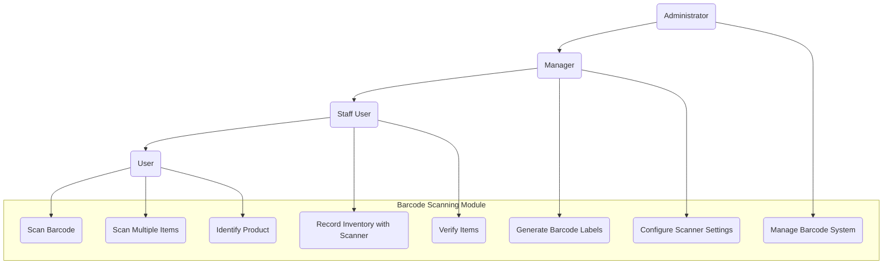

# 3.7 Barcode Scanning Module

This section details the requirements for the Barcode Scanning Module, which provides functionality for scanning, generating, and managing barcodes and QR codes throughout the inventory management process.

## Use Case Diagram

## 3.7.1 Barcode Scanning

### Description

The system shall provide capabilities to scan and process various barcode and QR code formats using the device camera or external scanners.

### User Stories

- As a warehouse staff member, I want to quickly scan items to identify them in the system
- As an inventory counter, I want to scan multiple items in sequence to speed up the counting process
- As a receiver, I want to scan incoming items to verify them against purchase orders

### Functional Requirements

#### FR-7.1.1: Single Item Scanning

- **Description**: The system shall allow scanning individual barcodes to identify products
- **Requirements**:
  - Camera-based barcode scanning
  - Support for external Bluetooth scanners
  - Automatic detection of barcode types
  - Quick product lookup from scan
  - Scan history logging
  - Audio/visual feedback on scan
  - Error handling for unrecognized barcodes
  - Manual entry fallback for damaged barcodes

#### FR-7.1.2: Bulk Scanning

- **Description**: The system shall support scanning multiple items in sequence
- **Requirements**:
  - Continuous scanning mode
  - Running count of scanned items
  - Duplicate detection options
  - Batch processing of scanned items
  - Pause/resume functionality
  - Progress indicators
  - Validation against expected items
  - Summary report of scan session

#### FR-7.1.3: Supported Barcode Formats

- **Description**: The system shall support multiple barcode and QR code formats
- **Requirements**:
  - 1D Barcodes: UPC-A, UPC-E, EAN-8, EAN-13, Code 39, Code 128
  - 2D Barcodes: QR Code, Data Matrix, PDF417, Aztec
  - Industry-specific formats as needed
  - Custom format configurations
  - Format auto-detection
  - Format priority settings
  - Fallback processing options

## 3.7.2 Scanning Integration with Inventory Processes

### Description

The system shall integrate barcode scanning capabilities with core inventory processes for efficiency and accuracy.

### User Stories

- As an inventory counter, I want scanning to automatically update count sheets
- As a shipping clerk, I want to scan items while packing to verify order accuracy
- As a stock clerk, I want to scan items during transfers to ensure correct movement

### Functional Requirements

#### FR-7.2.1: Inventory Count Integration

- **Description**: The system shall integrate scanning with inventory counting processes
- **Requirements**:
  - Direct update of count sheets from scans
  - Count mode with quantity entry
  - Scan verification against expected items
  - Discrepancy highlighting
  - Location validation during counting
  - Progress tracking against count list
  - Real-time count updates
  - Count completion verification

#### FR-7.2.2: Receiving Process Integration

- **Description**: The system shall integrate scanning with receiving processes
- **Requirements**:
  - Scan against purchase order line items
  - Quantity validation during receiving
  - Serial number capture during scanning
  - Lot/batch information entry
  - Receiving completion tracking
  - Exception handling for unexpected items
  - Quality control inspection integration
  - Receipt documentation generation

#### FR-7.2.3: Transfer Process Integration

- **Description**: The system shall integrate scanning with transfer processes
- **Requirements**:
  - Verify items for transfer out
  - Confirm items for transfer in
  - Transfer quantity validation
  - Location verification during transfer
  - Transfer progress tracking
  - Discrepancy documentation
  - Transfer completion confirmation
  - Transfer documentation generation

## 3.7.3 Barcode Generation and Printing

### Description

The system shall provide capabilities to generate and print barcode labels for products and locations.

### User Stories

- As a product manager, I want to generate barcode labels for new products
- As a warehouse manager, I want to print location labels with QR codes for easy scanning
- As an inventory manager, I want to create batch labels with product and lot information

### Functional Requirements

#### FR-7.3.1: Barcode Generation

- **Description**: The system shall generate barcodes and QR codes based on product data
- **Requirements**:
  - Multiple barcode format support
  - Automatic generation based on product SKU/ID
  - Custom data encoding options
  - Batch generation for multiple products
  - Preview before generation
  - Regeneration capabilities
  - Barcode validation testing
  - Integration with product creation workflow

#### FR-7.3.2: Label Design

- **Description**: The system shall provide label design capabilities
- **Requirements**:
  - Customizable label templates
  - Variable data fields
  - Size and layout configuration
  - Text formatting options
  - Multiple barcodes per label
  - Image inclusion capability
  - Template library management
  - WYSIWYG editor interface

#### FR-7.3.3: Label Printing

- **Description**: The system shall support printing barcode labels
- **Requirements**:
  - Support for standard printers
  - Special barcode printer support
  - Batch printing capabilities
  - Print queue management
  - Label sheet configuration
  - Print preview functionality
  - Digital label generation (PDF)
  - Print job history

## 3.7.4 Mobile Scanning Features

### Description

The system shall provide mobile-specific barcode scanning features optimized for use on smartphones and tablets.

### User Stories

- As a mobile user, I want an optimized camera scanning interface for easy use in the warehouse
- As a field staff member, I want to scan items offline and sync later
- As a supervisor, I want to use my mobile device to verify inventory across locations

### Functional Requirements

#### FR-7.4.1: Mobile Camera Optimization

- **Description**: The system shall optimize camera-based scanning for mobile devices
- **Requirements**:
  - Auto-focus optimization
  - Low-light scanning capabilities
  - Scan stabilization features
  - Wide-angle support for bulk scanning
  - Camera flash control
  - Zoom functionality
  - Portrait/landscape mode support
  - Battery usage optimization

#### FR-7.4.2: Offline Scanning

- **Description**: The system shall support offline barcode scanning
- **Requirements**:
  - Local cache of product information
  - Queue scanned items when offline
  - Batch synchronization when online
  - Offline status indicators
  - Conflict resolution for offline scans
  - Storage management for offline data
  - Data integrity validation
  - Sync status reporting

#### FR-7.4.3: Enhanced Mobile Features

- **Description**: The system shall provide additional mobile-specific scanning features
- **Requirements**:
  - Voice confirmation of scans
  - Haptic feedback options
  - Quick-access camera button
  - Gesture controls for scanning
  - AR item highlighting (future enhancement)
  - Location-based scanning suggestions
  - Camera permission management
  - Power-saving scan mode

## 3.7.5 Scanner Configuration and Management

### Description

The system shall allow configuration and management of scanning devices and settings.

### User Stories

- As an administrator, I want to configure scanner settings to optimize for our environment
- As a manager, I want to register external scanning devices for use with the system
- As a user, I want to customize scan settings for my specific workflow

### Functional Requirements

#### FR-7.5.1: Scanner Settings

- **Description**: The system shall provide configurable scanner settings
- **Requirements**:
  - Scan accuracy settings
  - Processing speed configuration
  - Preferred barcode formats
  - Default scan actions
  - Auto-processing options
  - Feedback configuration (sound, vibration, visual)
  - Camera configuration
  - Power usage optimization

#### FR-7.5.2: External Scanner Management

- **Description**: The system shall support management of external scanning devices
- **Requirements**:
  - Bluetooth scanner pairing
  - USB scanner configuration
  - Scanner testing interface
  - Scanner firmware compatibility checks
  - Multiple scanner profiles
  - Scanner performance monitoring
  - Troubleshooting diagnostics
  - Scanner battery monitoring

#### FR-7.5.3: Scan Workflow Configuration

- **Description**: The system shall allow configuration of scan workflows
- **Requirements**:
  - Custom actions after scan
  - Scan sequence definition
  - Required data input with scans
  - Scan verification requirements
  - Process-specific scan settings
  - User-specific scan preferences
  - Shortcut configuration
  - Default quantity settings
