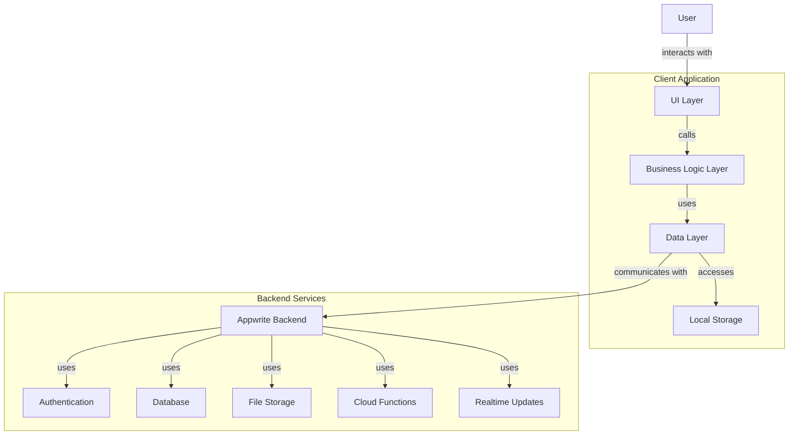

# 5.1 Architecture Overview

This section describes the high-level architecture of the Inventory Management Application, including the key architectural patterns, major components, and their interactions.

## Architecture Principles

The architecture of the Inventory Management Application is guided by the following principles:

1. **Cross-Platform Compatibility**: The application will be developed using Flutter to ensure consistent functionality and user experience across iOS, Android, and web platforms.

2. **Offline-First Design**: The application will support offline operation with synchronization when connectivity is restored.

3. **Clean Architecture**: The application will follow clean architecture principles with clear separation of concerns between UI, business logic, and data layers.

4. **Scalability**: The architecture will allow the system to scale in terms of users, data volume, and functionality.

5. **Security by Design**: Security considerations are built into the architecture at all levels.

6. **Testability**: The architecture facilitates comprehensive testing at all levels.

7. **Maintainability**: The system is designed for long-term maintainability and extensibility.

## High-Level Architecture

The architecture follows a layered approach with clear boundaries between different concerns:

### Client Application

#### 1. UI Layer

- **Responsibility**: Presentation of information and user interaction
- **Components**:
  - Flutter widgets for various screens and components
  - Screen navigation and routing
  - Platform-specific UI adaptations
  - State management using Provider/Bloc/Riverpod
- **Key Features**:
  - Responsive design for multiple form factors
  - Material Design implementation
  - Cross-platform consistency

#### 2. Business Logic Layer

- **Responsibility**: Implementation of business rules and application logic
- **Components**:
  - Use cases representing application features
  - Domain models representing business entities
  - Business logic services
  - State management
- **Key Features**:
  - Platform-independent logic
  - Testable business rules
  - Feature encapsulation

#### 3. Data Layer

- **Responsibility**: Data access and manipulation
- **Components**:
  - Repositories for data abstraction
  - Data sources (remote and local)
  - Data models for persistence
  - Synchronization services
- **Key Features**:
  - Offline-first data handling
  - Data caching strategies
  - Conflict resolution

#### 4. Local Storage

- **Responsibility**: Persistent storage on the client device
- **Components**:
  - SQLite database for structured data
  - File system for document/image storage
  - Secure storage for sensitive data
- **Key Features**:
  - Encrypted storage for sensitive data
  - Efficient querying capabilities
  - Storage optimization for mobile devices

### Backend Services (Appwrite)

#### 1. Authentication

- **Responsibility**: User identity management and access control
- **Components**:
  - Appwrite Authentication service
  - Role-based access control
  - Multi-factor authentication
- **Key Features**:
  - Secure user authentication
  - Session management
  - Authentication flow customization

#### 2. Database

- **Responsibility**: Structured data storage and retrieval
- **Components**:
  - Appwrite Database service
  - Collections for different data types
  - Indexes for efficient querying
- **Key Features**:
  - Schematic data storage
  - Access control at collection/document level
  - Real-time data updates

#### 3. File Storage

- **Responsibility**: Storage of files and media
- **Components**:
  - Appwrite Storage service
  - File organization and categorization
- **Key Features**:
  - Secure file storage
  - Image optimization
  - Access control for files

#### 4. Cloud Functions

- **Responsibility**: Server-side logic execution
- **Components**:
  - Appwrite Functions service
  - Backend business logic
  - Integration with external services
- **Key Features**:
  - Event-driven processing
  - Scheduled tasks
  - Complex server-side operations

#### 5. Realtime Updates

- **Responsibility**: Push updates to clients
- **Components**:
  - Appwrite Realtime service
  - Subscription management
- **Key Features**:
  - Real-time data synchronization
  - Efficient update propagation
  - Reduced polling requirements

## Key Architectural Patterns

### 1. Repository Pattern

The application uses the Repository pattern to abstract the data sources from the business logic. This enables:

- Separation of concerns between data access and business logic
- Ability to swap data sources without affecting the business logic
- Centralized data access policies and caching strategies

### 2. MVVM (Model-View-ViewModel) Pattern

For the UI layer, the application follows MVVM pattern:

- **Model**: Business entities and data
- **View**: Flutter widgets representing UI components
- **ViewModel**: Manages UI state and business logic for views

### 3. Dependency Injection

The application uses dependency injection to:

- Manage dependencies between components
- Facilitate unit testing through mock dependencies
- Improve modularity and flexibility

### 4. Event-Driven Architecture

For real-time updates and system notifications:

- Publish-subscribe model for notifications
- Event-based communication between loosely coupled components
- Realtime updates using Appwrite's subscription capabilities

### 5. Offline-First Pattern

To support operation without persistent network connectivity:

- Local-first data operations with background synchronization
- Optimistic UI updates with conflict resolution
- Queuing of operations for later synchronization

## Technical Stack Summary

### Frontend

- **Framework**: Flutter
- **Language**: Dart
- **State Management**: Provider/Bloc/Riverpod
- **Local Storage**: Sqflite, Hive, or similar solution
- **HTTP Client**: Dio or http package

### Backend (Appwrite)

- **Authentication**: Appwrite Auth
- **Database**: Appwrite Database
- **Storage**: Appwrite Storage
- **Functions**: Appwrite Functions
- **Realtime**: Appwrite Realtime

### Development and DevOps

- **Version Control**: Git
- **CI/CD**: GitHub Actions or similar
- **Testing**: Flutter Test, Mockito
- **Analytics**: Firebase Analytics or similar
