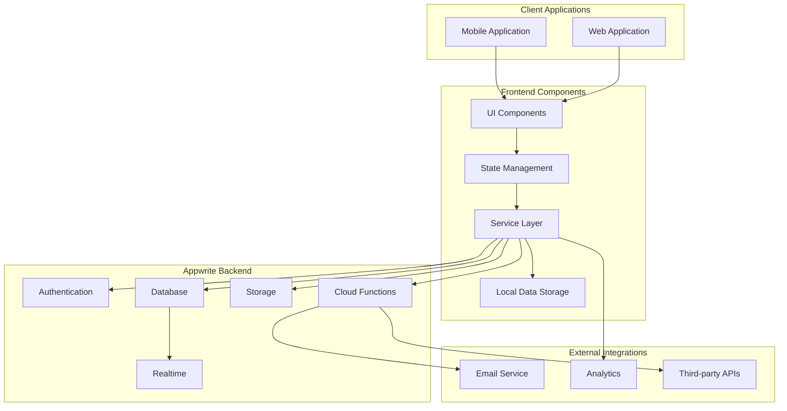
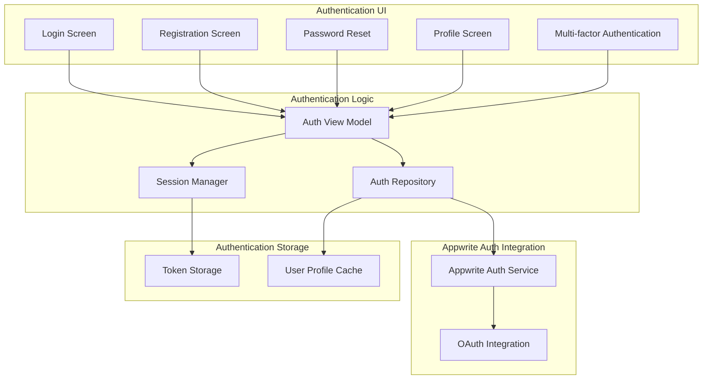
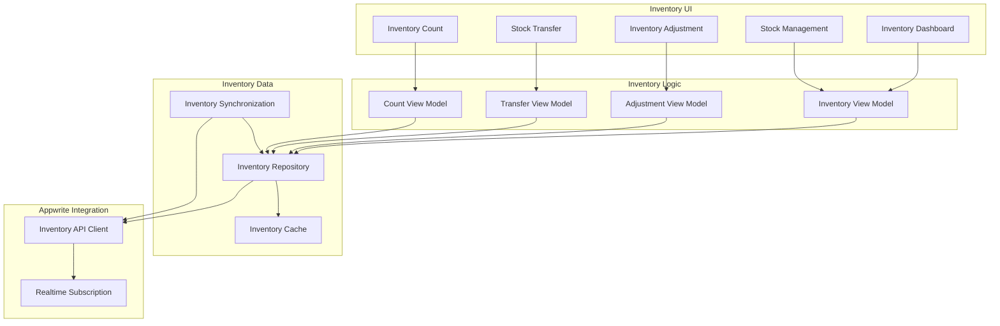
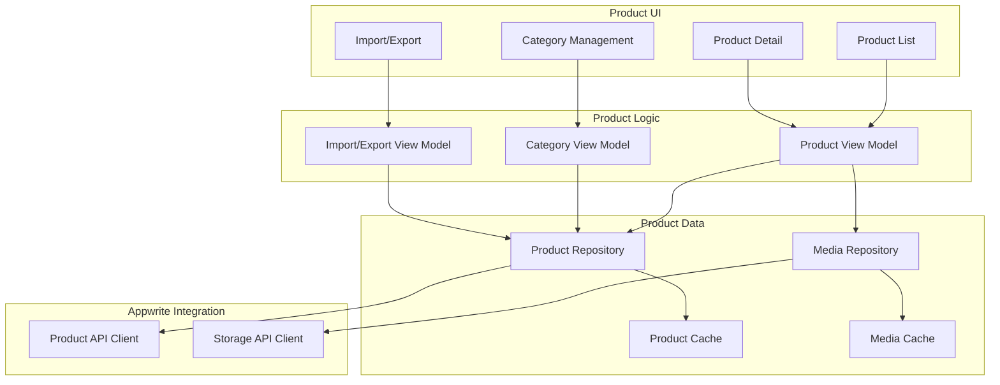
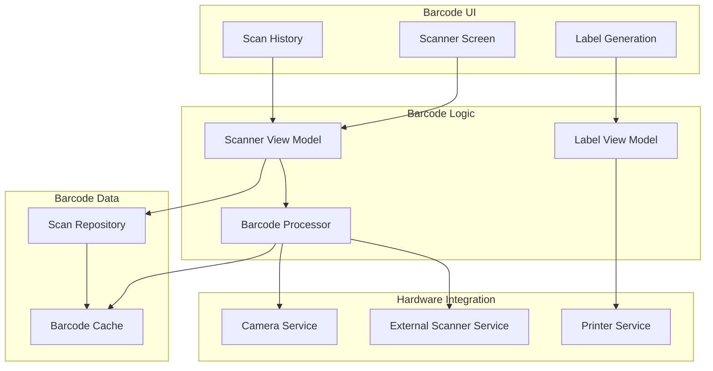
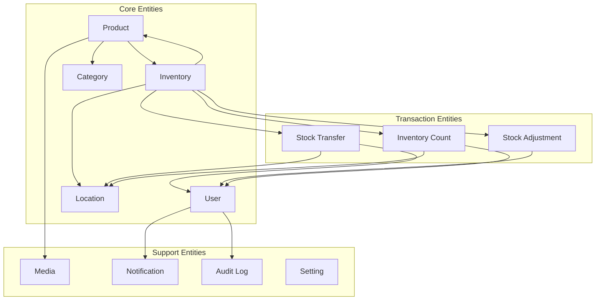
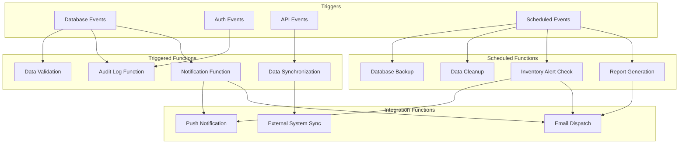

# 5.2 Component Diagram

This section provides detailed component diagrams showing the major components of the Inventory Management Application and their interactions.

## Overall System Component Diagram

## Client Application Components

```mermaid
graph TD
    subgraph "UI Layer"
        direction TB
        Screens[Screens]
        Widgets[Reusable Widgets]
        Navigation[Navigation]
        ThemeSystem[Theme System]
    end

    subgraph "State Management"
        direction TB
        ViewModels[View Models]
        StateProviders[State Providers]
        EventHandlers[Event Handlers]
    end

    subgraph "Feature Modules"
        direction TB
        AuthModule[Authentication Module]
        InventoryModule[Inventory Management Module]
        ProductModule[Product Module]
        ReportingModule[Reporting Module]
        NotificationModule[Notification Module]
        UserManagementModule[User Management Module]
        BarcodeModule[Barcode Scanning Module]
    end

    subgraph "Service Layer"
        direction TB
        ApiClients[API Clients]
        Repositories[Repositories]
        LocalDataAccess[Local Data Access]
        SyncService[Synchronization Service]
    end

    %% Connections between client components
    Screens --> Widgets
    Screens --> Navigation
    Screens --> ThemeSystem
    Screens --> ViewModels
    ViewModels --> StateProviders
    ViewModels --> EventHandlers

    AuthModule --> Repositories
    InventoryModule --> Repositories
    ProductModule --> Repositories
    ReportingModule --> Repositories
    NotificationModule --> Repositories
    UserManagementModule --> Repositories
    BarcodeModule --> Repositories

    Repositories --> ApiClients
    Repositories --> LocalDataAccess
    SyncService --> ApiClients
    SyncService --> LocalDataAccess
```

## Authentication Module Components

## Inventory Management Module Components

## Product Module Components

## Barcode Scanning Module Components

## Database Schema Component Relationships

## Cloud Function Components

These component diagrams provide a visual representation of the system architecture, showing how different parts of the Inventory Management Application interact with each other. The modular design allows for clear separation of concerns and facilitates maintenance and future enhancements.
