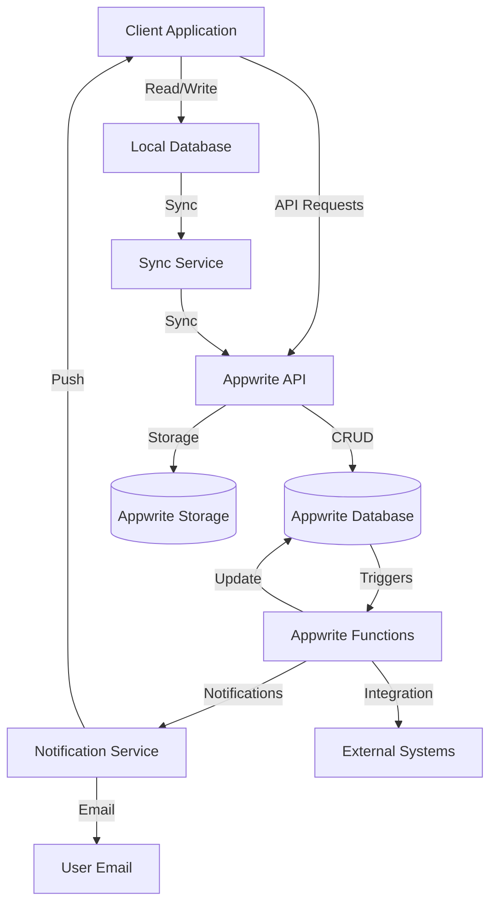

# 5.3 Data Architecture

This section describes the data architecture of the Inventory Management Application, including the database schema, data models, relationships, and data flow between components.

## Data Storage Solutions

The application uses a combination of storage solutions:

1. **Remote Database**: Appwrite Database for primary data storage
2. **Local Database**: SQLite/Hive for offline data storage on client devices
3. **File Storage**: Appwrite Storage for document and image storage
4. **Secure Storage**: Encrypted storage for sensitive data (credentials, tokens)
5. **Cache Storage**: In-memory and persistent caching for performance optimization

## Database Collections and Schemas

### Core Collections

#### Users Collection

```json
{
  "id": "unique_id",
  "name": "Full Name",
  "email": "user@example.com",
  "phone": "1234567890",
  "role": "admin|manager|staff",
  "status": "active|inactive|pending",
  "locations": ["location_id1", "location_id2"],
  "preferences": {
    "theme": "light|dark|system",
    "notifications": {
      "email": true,
      "push": true,
      "inApp": true
    },
    "defaultLocation": "location_id"
  },
  "lastActive": "2023-05-01T10:30:00Z",
  "created": "2023-01-01T08:00:00Z",
  "updated": "2023-05-01T10:30:00Z"
}
```

#### Products Collection

```json
{
  "id": "unique_id",
  "sku": "SKU123456",
  "name": "Product Name",
  "description": "Detailed product description",
  "categoryId": "category_id",
  "barcodes": [
    {
      "type": "UPC",
      "code": "123456789012"
    },
    {
      "type": "EAN",
      "code": "5901234123457"
    }
  ],
  "attributes": {
    "color": "Red",
    "size": "Large",
    "weight": 1.5,
    "dimensions": {
      "length": 10,
      "width": 5,
      "height": 2
    }
  },
  "status": "active|inactive|discontinued",
  "parentProductId": null,
  "variantAttributes": ["color", "size"],
  "costPrice": 10.5,
  "retailPrice": 19.99,
  "taxRate": 0.07,
  "minStockLevel": 5,
  "maxStockLevel": 100,
  "reorderPoint": 10,
  "reorderQuantity": 25,
  "leadTime": 5,
  "mediaIds": ["media_id1", "media_id2"],
  "created": "2023-01-15T09:30:00Z",
  "updated": "2023-06-01T14:45:00Z",
  "createdBy": "user_id",
  "updatedBy": "user_id"
}
```

#### Inventory Collection

```json
{
  "id": "unique_id",
  "productId": "product_id",
  "locationId": "location_id",
  "quantity": 42,
  "reservedQuantity": 3,
  "availableQuantity": 39,
  "lastCountDate": "2023-05-10T08:30:00Z",
  "lastCountQuantity": 45,
  "averageCost": 10.25,
  "totalValue": 430.5,
  "batchInfo": [
    {
      "batchId": "batch_id",
      "quantity": 20,
      "expiryDate": "2024-01-31T00:00:00Z",
      "receivedDate": "2023-05-01T00:00:00Z",
      "lotNumber": "LOT12345"
    }
  ],
  "binLocation": "A1-B2-C3",
  "notes": "Special storage requirements",
  "lastUpdated": "2023-06-15T11:20:00Z",
  "updatedBy": "user_id"
}
```

#### Locations Collection

```json
{
  "id": "unique_id",
  "name": "Warehouse A",
  "type": "warehouse|store|virtual",
  "address": {
    "street": "123 Main St",
    "city": "Anytown",
    "state": "CA",
    "postalCode": "12345",
    "country": "USA"
  },
  "contact": {
    "name": "Manager Name",
    "email": "manager@example.com",
    "phone": "1234567890"
  },
  "status": "active|inactive|temporary",
  "parentLocationId": null,
  "settings": {
    "requiresApproval": true,
    "allowNegativeStock": false,
    "autoReorder": true
  },
  "created": "2022-12-01T10:00:00Z",
  "updated": "2023-05-15T16:20:00Z"
}
```

#### Categories Collection

```json
{
  "id": "unique_id",
  "name": "Electronics",
  "description": "Electronic devices and accessories",
  "parentCategoryId": null,
  "level": 1,
  "path": "/electronics",
  "attributes": [
    {
      "name": "voltage",
      "type": "number",
      "required": true,
      "options": null
    },
    {
      "name": "powerSource",
      "type": "select",
      "required": false,
      "options": ["Battery", "AC", "Solar", "USB"]
    }
  ],
  "mediaId": "media_id",
  "status": "active|inactive",
  "created": "2023-01-05T11:30:00Z",
  "updated": "2023-05-20T09:15:00Z"
}
```

### Transaction Collections

#### Stock Transfers Collection

```json
{
  "id": "unique_id",
  "referenceNumber": "TRF-2023-00001",
  "sourceLocationId": "source_location_id",
  "destinationLocationId": "destination_location_id",
  "status": "draft|requested|approved|in_progress|in_transit|delivered|verified|cancelled",
  "requestedBy": "user_id",
  "approvedBy": "user_id",
  "requestedDate": "2023-06-01T09:00:00Z",
  "approvedDate": "2023-06-01T10:30:00Z",
  "expectedDeliveryDate": "2023-06-03T00:00:00Z",
  "completedDate": "2023-06-02T14:45:00Z",
  "notes": "Urgent transfer for store restocking",
  "items": [
    {
      "productId": "product_id",
      "requestedQuantity": 10,
      "sentQuantity": 10,
      "receivedQuantity": 9,
      "discrepancyReason": "One item damaged during transit",
      "batchInfo": {
        "batchId": "batch_id",
        "lotNumber": "LOT12345",
        "expiryDate": "2024-01-31T00:00:00Z"
      }
    }
  ],
  "created": "2023-06-01T09:00:00Z",
  "updated": "2023-06-02T14:45:00Z"
}
```

#### Stock Adjustments Collection

```json
{
  "id": "unique_id",
  "referenceNumber": "ADJ-2023-00001",
  "locationId": "location_id",
  "adjustmentType": "count|damage|loss|correction|return|write_off",
  "status": "draft|pending_approval|approved|rejected|completed",
  "requestedBy": "user_id",
  "approvedBy": "user_id",
  "requestedDate": "2023-06-05T11:20:00Z",
  "approvedDate": "2023-06-05T13:45:00Z",
  "notes": "Adjustment after physical count",
  "items": [
    {
      "productId": "product_id",
      "currentQuantity": 15,
      "newQuantity": 12,
      "adjustmentQuantity": -3,
      "reason": "damaged|expired|lost|found|count_correction",
      "notes": "Items damaged during handling",
      "cost": 10.5,
      "value": -31.5
    }
  ],
  "totalValue": -31.5,
  "created": "2023-06-05T11:20:00Z",
  "updated": "2023-06-05T13:45:00Z"
}
```

#### Inventory Counts Collection

```json
{
  "id": "unique_id",
  "referenceNumber": "CNT-2023-00001",
  "locationId": "location_id",
  "countType": "full|partial|cycle|spot",
  "status": "scheduled|in_progress|completed|cancelled",
  "scheduledDate": "2023-06-10T08:00:00Z",
  "startDate": "2023-06-10T08:00:00Z",
  "completedDate": "2023-06-10T12:30:00Z",
  "assignedTo": ["user_id1", "user_id2"],
  "createdBy": "user_id",
  "approvedBy": "user_id",
  "notes": "Quarterly inventory count",
  "filters": {
    "categoryIds": ["category_id1", "category_id2"],
    "binLocations": ["A1-*", "B2-*"],
    "abcClass": "A"
  },
  "items": [
    {
      "productId": "product_id",
      "expectedQuantity": 50,
      "countedQuantity": 48,
      "variance": -2,
      "variancePercentage": -4,
      "countedBy": "user_id",
      "countedAt": "2023-06-10T10:15:00Z",
      "notes": "Two items appear to be missing",
      "status": "counted|reconciled|adjusted"
    }
  ],
  "summary": {
    "totalProducts": 120,
    "countedProducts": 120,
    "matchedProducts": 110,
    "varianceProducts": 10,
    "totalVarianceValue": -245.75
  },
  "created": "2023-06-01T09:00:00Z",
  "updated": "2023-06-10T12:30:00Z"
}
```

### Support Collections

#### Media Collection

```json
{
  "id": "unique_id",
  "name": "Product Image",
  "type": "image|document|video",
  "mimeType": "image/jpeg",
  "size": 256000,
  "fileId": "appwrite_storage_id",
  "thumbnailId": "thumbnail_id",
  "metadata": {
    "width": 1200,
    "height": 800,
    "alt": "Front view of product"
  },
  "tags": ["front", "product", "catalog"],
  "entityType": "product|category|location",
  "entityId": "related_entity_id",
  "isPrimary": true,
  "sortOrder": 1,
  "uploadedBy": "user_id",
  "created": "2023-05-10T14:30:00Z",
  "updated": "2023-05-10T14:30:00Z"
}
```

#### Notifications Collection

```json
{
  "id": "unique_id",
  "type": "low_stock|approval_required|transfer_received|count_scheduled|system|custom",
  "title": "Low Stock Alert",
  "message": "Product X is below reorder point",
  "priority": "low|medium|high|critical",
  "status": "new|read|actioned|archived",
  "userId": "user_id",
  "roleIds": ["role_id1", "role_id2"],
  "entityType": "product|transfer|adjustment|count",
  "entityId": "related_entity_id",
  "action": {
    "type": "link|button",
    "label": "View Product",
    "target": "/products/view/product_id"
  },
  "expiresAt": "2023-07-10T00:00:00Z",
  "created": "2023-06-15T10:25:00Z",
  "updated": "2023-06-15T10:25:00Z"
}
```

#### Audit Logs Collection

```json
{
  "id": "unique_id",
  "action": "create|update|delete|login|logout|approve|reject|transfer|adjust",
  "entityType": "product|inventory|user|transfer|adjustment|count",
  "entityId": "related_entity_id",
  "userId": "user_id",
  "userIp": "192.168.1.1",
  "userAgent": "Mozilla/5.0 ...",
  "locationId": "location_id",
  "before": {},
  "after": {},
  "changes": [
    {
      "field": "quantity",
      "oldValue": 10,
      "newValue": 15
    }
  ],
  "notes": "Quantity updated after inventory count",
  "timestamp": "2023-06-16T09:45:00Z"
}
```

#### Settings Collection

```json
{
  "id": "unique_id",
  "group": "system|inventory|product|notification|user",
  "key": "setting_key",
  "value": "setting_value",
  "valueType": "string|number|boolean|json",
  "scope": "global|location|user",
  "scopeId": "scope_entity_id",
  "description": "Description of what this setting controls",
  "created": "2023-01-01T00:00:00Z",
  "updated": "2023-05-15T11:30:00Z",
  "updatedBy": "user_id"
}
```

## Local Data Storage Schema

For offline support, the mobile application maintains a subset of the server database in local storage:

### Local Inventory Database

```
- products (cached product data)
- inventory (local inventory records)
- transactions (pending transfers, adjustments, counts)
- media_cache (locally cached images)
- sync_queue (pending operations for sync)
- settings (user and application settings)
- user_data (user profile and preferences)
```

## Data Flow Architecture



## Data Synchronization Process

The application implements a sophisticated data synchronization process to ensure data consistency between client devices and the server:

1. **Real-time Updates**: Critical data changes are pushed to connected clients via Appwrite Realtime service.

2. **Periodic Sync**: A scheduled sync process runs at configurable intervals to synchronize data changes in both directions.

3. **Manual Sync**: Users can initiate manual synchronization when needed.

4. **Conflict Resolution**: The sync process includes conflict detection and resolution mechanisms:

   - Server timestamp-based resolution
   - Last-write-wins strategy for simple conflicts
   - Merge strategies for compatible changes
   - User resolution for complex conflicts

5. **Sync Prioritization**: Data is synchronized in order of priority:

   - Critical operational data (inventories, transfers)
   - Reference data (products, locations)
   - Historical and reporting data

6. **Delta Synchronization**: Only changed data is transferred to minimize bandwidth usage.

## Data Security Measures

1. **Encryption**:

   - All data in transit is encrypted using TLS
   - Sensitive data at rest is encrypted in both server and client storage
   - End-to-end encryption for highly sensitive data

2. **Access Control**:

   - Document-level security rules in Appwrite
   - Attribute-based access control for field-level security
   - Role-based permissions for functional access

3. **Data Validation**:

   - Schema validation for all data operations
   - Business rule validation through Appwrite functions
   - Client-side validation for immediate feedback

4. **Audit Trail**:
   - Comprehensive logging of all data modifications
   - User action tracking for accountability
   - Tamper-evident audit logs

## Data Backup and Recovery

1. **Backup Procedures**:

   - Automated daily backups of all collections
   - Point-in-time recovery capabilities
   - Geo-redundant backup storage

2. **Recovery Procedures**:

   - Collection-level restoration capability
   - Document-level recovery for targeted fixes
   - Data validation during restoration

3. **Business Continuity**:
   - Offline operation during connectivity issues
   - Local backup of critical operational data
   - Automatic recovery upon reconnection
