# 5.4 Integration Architecture

This section describes the integration architecture of the Inventory Management Application, detailing how the system interfaces with external systems, services, and APIs.

## Integration Approach

The Inventory Management Application follows these integration principles:

1. **API-First Design**: All integrations are built on well-defined APIs
2. **Loose Coupling**: Minimal dependencies between integrated systems
3. **Security by Design**: Secure authentication and authorization for all integrations
4. **Resilience**: Graceful handling of integration failures
5. **Standardization**: Consistent patterns for different types of integrations
6. **Extensibility**: Easy addition of new integrations

## Integration Patterns

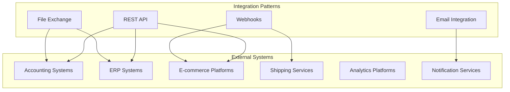

### REST API Integration

The application provides and consumes RESTful APIs for synchronous integrations:

1. **API Gateway**: Appwrite Functions acts as an API gateway for external systems
2. **Authentication**: OAuth 2.0 or API key authentication for all API endpoints
3. **Data Formats**: JSON for request and response bodies
4. **Versioning**: API versioning (v1, v2) to maintain backward compatibility
5. **Rate Limiting**: Protection against excessive API usage
6. **Documentation**: OpenAPI/Swagger documentation for all exposed endpoints

### Webhook Integration

The system supports webhook-based event-driven integrations:

1. **Event Publishing**: Outbound webhooks for system events
2. **Event Consumption**: Inbound webhook endpoints for external events
3. **Retry Mechanism**: Automatic retries for failed webhook deliveries
4. **Signature Verification**: Security verification of webhook sources
5. **Webhook Management**: Interface for managing webhook subscriptions and endpoints

### File-Based Integration

For batch processing and legacy system integration:

1. **Import/Export**: Standardized file formats (CSV, Excel, XML)
2. **Secure Transfer**: Secure file transfer protocols
3. **Scheduled Exchange**: Automated scheduled file exchanges
4. **Transformation**: Data mapping and transformation capabilities
5. **Validation**: Comprehensive validation of imported data

### Email Integration

Email-based integrations for notifications and reporting:

1. **Notification Delivery**: Email notifications for system events
2. **Report Distribution**: Scheduled report distribution via email
3. **Email Processing**: Processing incoming emails for specific functions
4. **Templating**: Customizable email templates
5. **Delivery Tracking**: Monitoring of email delivery status

## External System Integrations

### Accounting Systems Integration

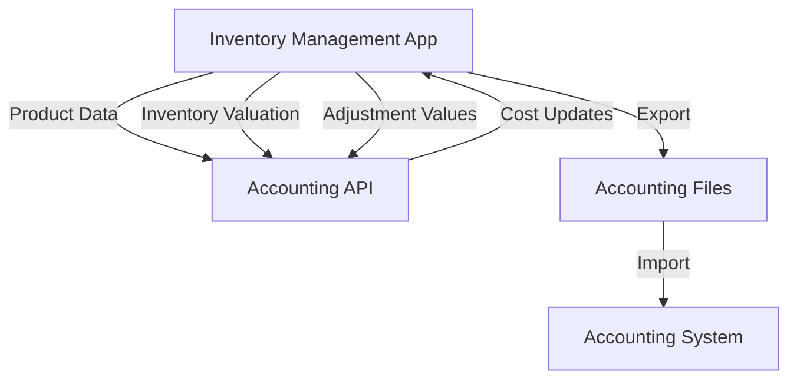

#### Integration Capabilities:

1. **Inventory Valuation**:

   - Periodic valuation data for accounting
   - Cost of goods sold calculations
   - Inventory asset reporting

2. **Cost Management**:

   - Average cost updates
   - Standard cost adjustments
   - Currency conversion for multi-currency operations

3. **Financial Transactions**:
   - Inventory adjustment financial impacts
   - Write-off accounting
   - Purchase order reconciliation

### E-commerce Platform Integration

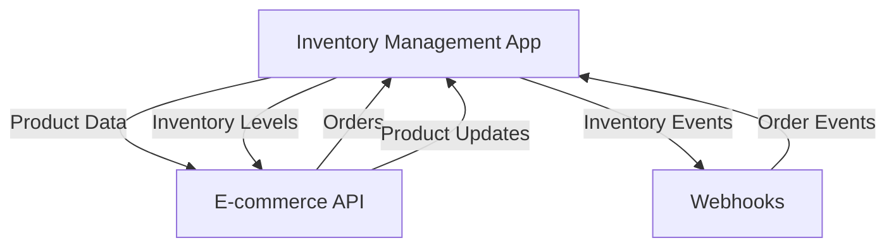

#### Integration Capabilities:

1. **Product Synchronization**:

   - Product data publishing to e-commerce platforms
   - Product attribute mapping
   - Category and taxonomy alignment

2. **Inventory Management**:

   - Real-time inventory level updates
   - Reserved inventory handling
   - Multi-channel allocation

3. **Order Processing**:
   - Order import from e-commerce platforms
   - Fulfillment status updates
   - Backorder management

### Shipping and Logistics Integration

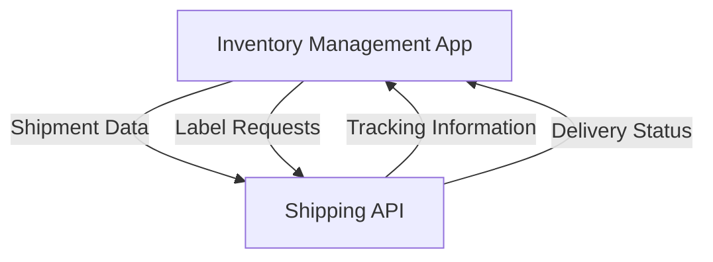

#### Integration Capabilities:

1. **Shipping Carriers**:

   - Integration with major shipping carriers
   - Shipping rate calculation
   - Label generation

2. **Tracking**:

   - Shipment tracking information
   - Delivery confirmation
   - Exception handling

3. **Logistics Planning**:
   - Route optimization
   - Delivery scheduling
   - Transfer documentation

### Analytics and Business Intelligence

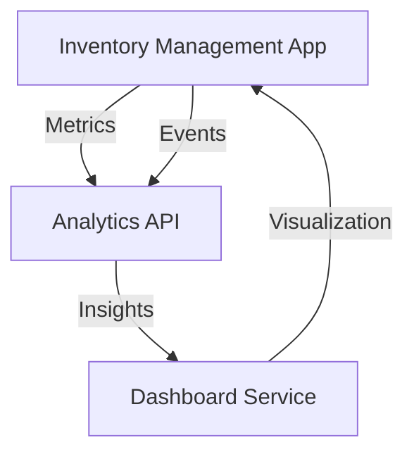

#### Integration Capabilities:

1. **Data Export**:

   - Structured data export for analysis
   - Real-time event streaming
   - Historical data warehousing

2. **Metrics Collection**:

   - Key performance indicators
   - Usage analytics
   - Business metrics

3. **Reporting Integration**:
   - Integration with reporting tools
   - Dashboard embedding
   - Custom report generation

## Integration Architecture Components

### API Gateway

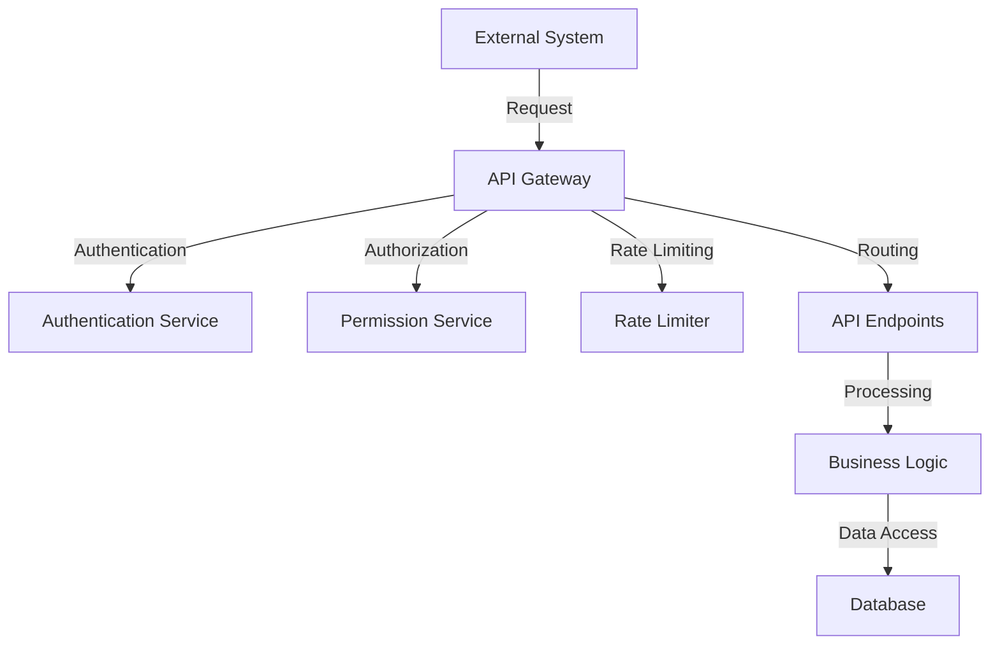

The API Gateway, implemented using Appwrite Functions, provides:

1. **Request Handling**:

   - HTTP request parsing and validation
   - Content negotiation
   - CORS support

2. **Security**:

   - Authentication verification
   - Authorization checks
   - Input validation

3. **Traffic Management**:
   - Rate limiting
   - Request throttling
   - Load balancing

### Integration Service Layer

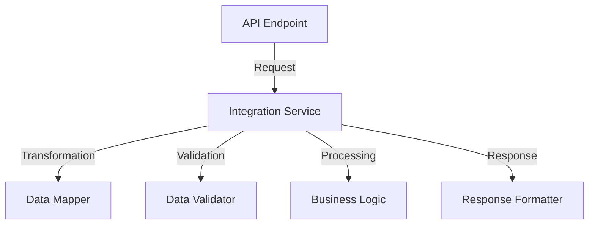

The Integration Service Layer provides:

1. **Protocol Adapters**:

   - HTTP/REST adapters
   - Webhook handlers
   - File format processors

2. **Data Transformation**:

   - Data mapping between systems
   - Format conversion
   - Schema alignment

3. **Integration Orchestration**:
   - Integration workflow management
   - Error handling and retries
   - Logging and monitoring

### External System Connectors

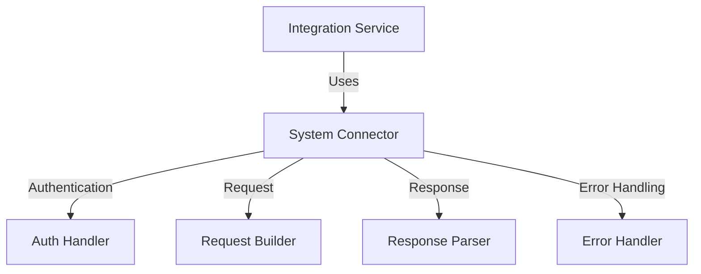

System-specific connectors provide:

1. **Connection Management**:

   - Connection pooling
   - Session management
   - Reconnection strategies

2. **System-Specific Logic**:

   - API peculiarities handling
   - Custom error processing
   - System-specific optimizations

3. **Monitoring**:
   - Performance tracking
   - Availability monitoring
   - Error rate tracking

## Integration Security

### Authentication Methods

The application supports these authentication methods for integrations:

1. **API Keys**:

   - Simple key-based authentication
   - Scoped permissions
   - Key rotation management

2. **OAuth 2.0**:

   - Authorization code flow
   - Client credentials flow
   - Token management

3. **JWT Tokens**:
   - Signed token validation
   - Token expiration handling
   - Claim-based permissions

### Data Protection

Security measures for integration data:

1. **Encryption**:

   - TLS for all communications
   - Payload encryption for sensitive data
   - Secure credential storage

2. **Data Minimization**:

   - Transfer only required data
   - Field-level access control
   - PII protection

3. **Audit Trail**:
   - Comprehensive logging of all integration activities
   - Integration-specific audit records
   - Security event monitoring

## Integration Management

### Configuration Management

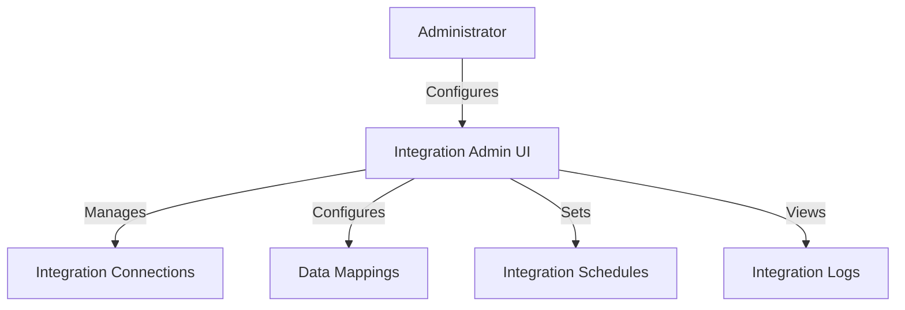

The Integration Management interface provides:

1. **Connection Setup**:

   - Endpoint configuration
   - Authentication setup
   - Testing capabilities

2. **Data Mapping**:

   - Field mapping configuration
   - Transformation rules
   - Default value configuration

3. **Scheduling**:
   - Integration frequency settings
   - Trigger configuration
   - Maintenance window settings

### Monitoring and Logging

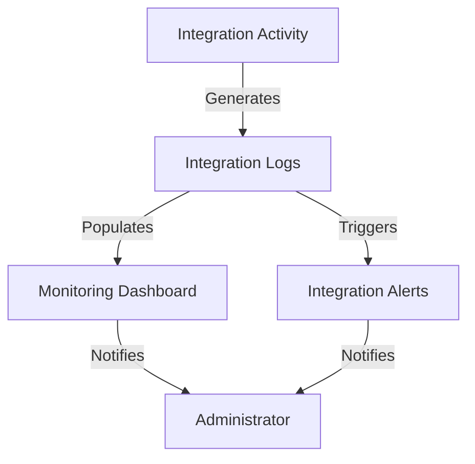

Monitoring capabilities include:

1. **Performance Monitoring**:

   - Response time tracking
   - Throughput measurement
   - Error rate monitoring

2. **Health Checks**:

   - Integration availability verification
   - Scheduled testing
   - Connectivity validation

3. **Error Tracking**:
   - Detailed error logging
   - Error categorization
   - Trend analysis

## Integration Deployment Model

The integration components are deployed following this model:

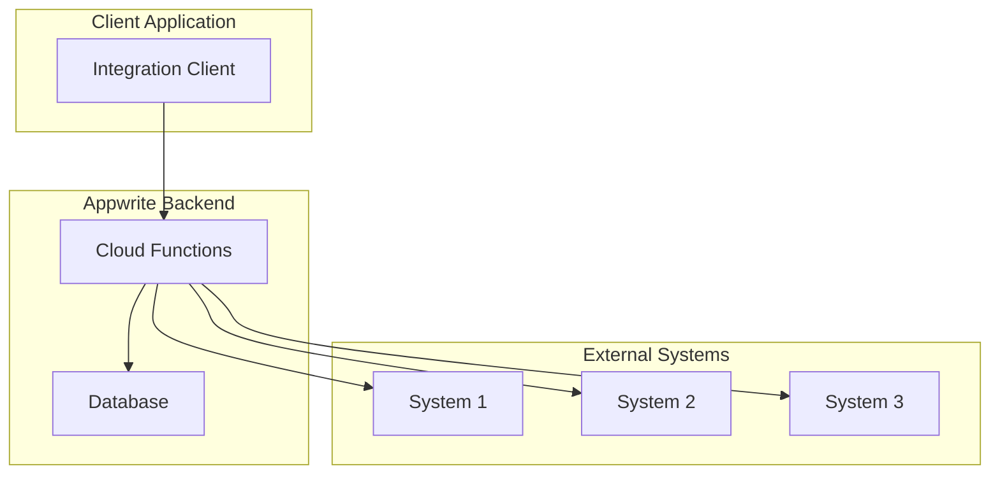

This deployment model ensures:

1. **Scalability**:

   - Independent scaling of integration services
   - Horizontal scaling for high-volume integrations
   - Resource isolation

2. **Maintainability**:

   - Separate deployment lifecycles
   - Focused testing
   - Simplified dependency management

3. **Security**:
   - Isolation of integration concerns
   - Targeted security controls
   - Reduced attack surface
