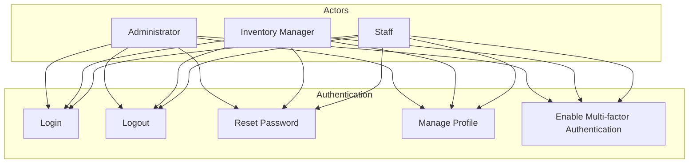
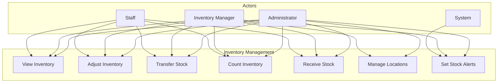
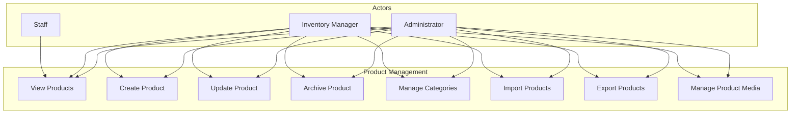
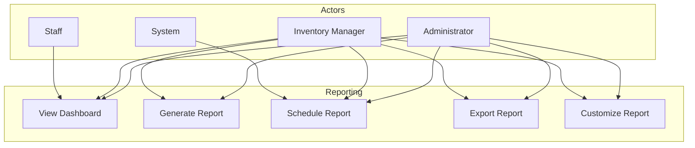
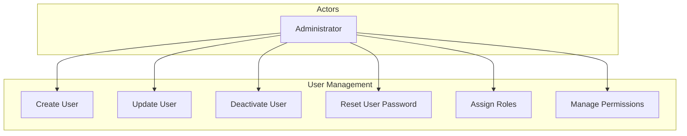
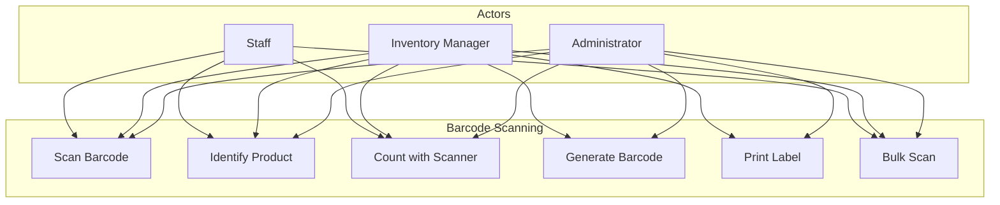

# 6.1 Use Case Diagrams

This section provides use case diagrams that illustrate the interactions between users and the Inventory Management Application.

## Main Use Case Diagram

```mermaid
graph TD
    subgraph Actors
        Admin[Administrator]
        Manager[Inventory Manager]
        Staff[Staff]
        System[System]
    end

    subgraph Authentication
        Login[Login]
        ManageAccount[Manage Account]
    end

    subgraph Product Management
        ManageProducts[Manage Products]
        ManageCategories[Manage Categories]
        ImportExportProducts[Import/Export Products]
    end

    subgraph Inventory Operations
        MonitorStock[Monitor Stock Levels]
        AdjustInventory[Adjust Inventory]
        TransferStock[Transfer Stock]
        CountInventory[Count Inventory]
    end

    subgraph Reporting
        GenerateReports[Generate Reports]
        ExportData[Export Data]
        ViewDashboards[View Dashboards]
    end

    Admin --> Login
    Manager --> Login
    Staff --> Login

    Admin --> ManageAccount
    Manager --> ManageAccount
    Staff --> ManageAccount

    Admin --> ManageProducts
    Manager --> ManageProducts

    Admin --> ManageCategories
    Manager --> ManageCategories

    Admin --> ImportExportProducts
    Manager --> ImportExportProducts

    Admin --> MonitorStock
    Manager --> MonitorStock
    Staff --> MonitorStock

    Admin --> AdjustInventory
    Manager --> AdjustInventory
    Staff --> AdjustInventory

    Admin --> TransferStock
    Manager --> TransferStock
    Staff --> TransferStock

    Admin --> CountInventory
    Manager --> CountInventory
    Staff --> CountInventory

    Admin --> GenerateReports
    Manager --> GenerateReports

    Admin --> ExportData
    Manager --> ExportData

    Admin --> ViewDashboards
    Manager --> ViewDashboards
    Staff --> ViewDashboards

    System --> MonitorStock
    System --> GenerateReports
```

## Authentication Module Use Cases

## Inventory Management Module Use Cases

## Product Module Use Cases

## Reporting Module Use Cases

## User Management Module Use Cases

## Barcode Scanning Module Use Cases

