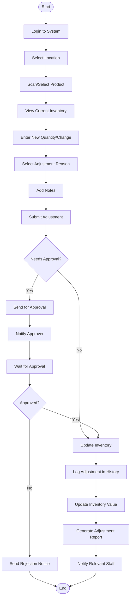
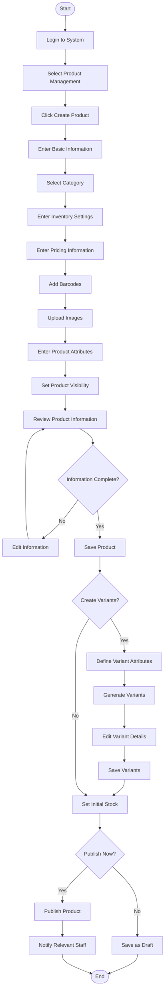
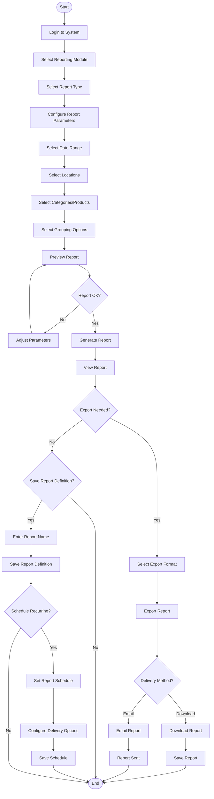
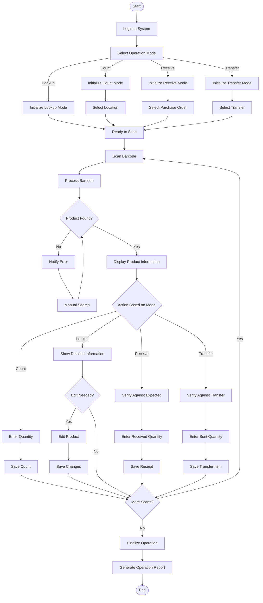

# 6.2 Activity Diagrams

This section provides activity diagrams that illustrate the key workflows and processes within the Inventory Management Application.

## Inventory Adjustment Process

## Stock Transfer Process

```mermaid
flowchart TD
    Start([Start]) --> Login[Login to System]
    Login --> TransferInit[Initiate Transfer]
    TransferInit --> SelectSource[Select Source Location]
    SelectSource --> SelectDestination[Select Destination Location]
    SelectDestination --> AddProducts[Add Products to Transfer]

    AddProducts --> ScanProduct[Scan/Select Product]
    ScanProduct --> EnterQuantity[Enter Quantity]
    EnterQuantity --> MoreProducts{More Products?}
    MoreProducts -->|Yes| ScanProduct
    MoreProducts -->|No| ReviewTransfer[Review Transfer]

    ReviewTransfer --> TransferOK{Transfer OK?}
    TransferOK -->|No| EditTransfer[Edit Transfer]
    EditTransfer --> ReviewTransfer
    TransferOK -->|Yes| SubmitTransfer[Submit Transfer Request]

    SubmitTransfer --> NeedsApproval{Needs Approval?}
    NeedsApproval -->|Yes| SendForApproval[Send for Approval]
    NeedsApproval -->|No| ProcessTransfer[Process Transfer]

    SendForApproval --> NotifyApprover[Notify Approver]
    NotifyApprover --> WaitForApproval[Wait for Approval]
    WaitForApproval --> ApprovalDecision{Approved?}
    ApprovalDecision -->|Yes| ProcessTransfer
    ApprovalDecision -->|No| RejectionNotice[Send Rejection Notice]
    RejectionNotice --> End

    ProcessTransfer --> UpdateSourceInventory[Update Source Inventory]
    UpdateSourceInventory --> GenerateShippingDoc[Generate Shipping Document]
    GenerateShippingDoc --> NotifyDestination[Notify Destination]

    NotifyDestination --> ItemsShipped[Items Shipped]
    ItemsShipped --> ItemsReceived[Items Received at Destination]
    ItemsReceived --> VerifyItems[Verify Items Received]

    VerifyItems --> Discrepancy{Discrepancy?}
    Discrepancy -->|Yes| RecordDiscrepancy[Record Discrepancy]
    RecordDiscrepancy --> ResolveDiscrepancy[Resolve Discrepancy]
    ResolveDiscrepancy --> UpdateFinalInventory[Update Final Inventory]
    Discrepancy -->|No| UpdateFinalInventory

    UpdateFinalInventory --> CompleteTransfer[Complete Transfer]
    CompleteTransfer --> NotifyAll[Notify All Parties]
    NotifyAll --> End([End])
```

## Inventory Count Process

```mermaid
flowchart TD
    Start([Start]) --> CreateCount[Create Inventory Count]
    CreateCount --> SelectLocation[Select Location]
    SelectLocation --> DefineScope[Define Count Scope]
    DefineScope --> ScheduleCount[Schedule Count]
    ScheduleCount --> AssignStaff[Assign Staff]
    AssignStaff --> PrepareCount[Prepare Count Sheets/Device]

    PrepareCount --> StartCount[Start Count]
    StartCount --> ScanItem[Scan/Enter Item]
    ScanItem --> RecordQuantity[Record Quantity]
    RecordQuantity --> MoreItems{More Items?}
    MoreItems -->|Yes| ScanItem
    MoreItems -->|No| ReviewCount[Review Count]

    ReviewCount --> CountComplete{Count Complete?}
    CountComplete -->|No| ContinueCounting[Continue Counting]
    ContinueCounting --> ScanItem
    CountComplete -->|Yes| SubmitCount[Submit Count]

    SubmitCount --> GenerateVariance[Generate Variance Report]
    GenerateVariance --> CheckVariance{Significant Variance?}
    CheckVariance -->|Yes| InvestigateVariance[Investigate Variance]
    InvestigateVariance --> RecountNeeded{Recount Needed?}
    RecountNeeded -->|Yes| PartialRecount[Perform Partial Recount]
    PartialRecount --> RecountComplete[Recount Complete]
    RecountComplete --> UpdateVariance[Update Variance Report]
    RecountNeeded -->|No| ApproveVariance[Approve Variance]

    CheckVariance -->|No| ApproveVariance
    UpdateVariance --> ApproveVariance

    ApproveVariance --> CreateAdjustments[Create Inventory Adjustments]
    CreateAdjustments --> UpdateInventory[Update Inventory Records]
    UpdateInventory --> GenerateFinalReport[Generate Final Count Report]
    GenerateFinalReport --> ArchiveCount[Archive Count Data]
    ArchiveCount --> End([End])
```

## Product Creation Process

## Report Generation Process

## Barcode Scanning for Inventory Operations

