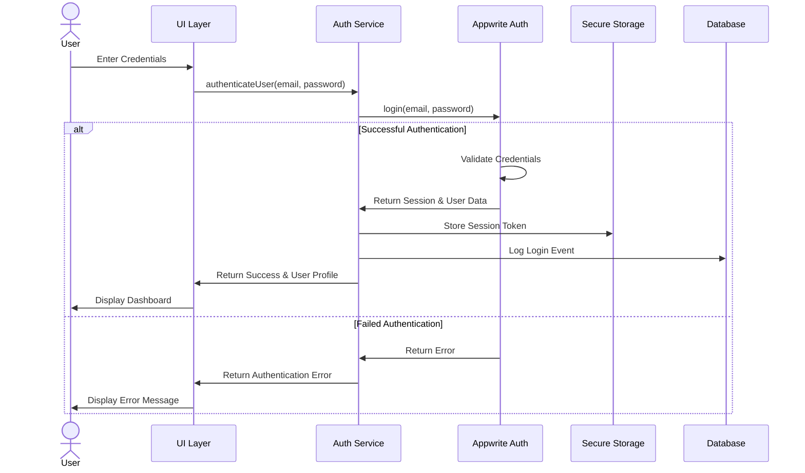
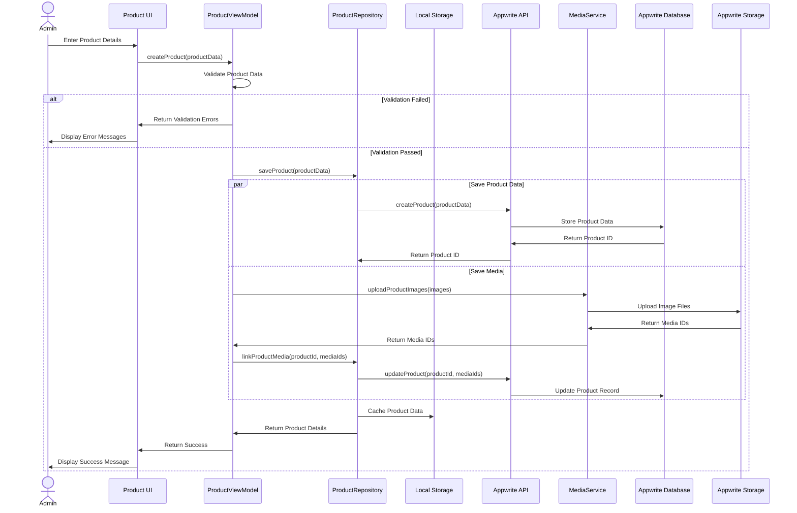
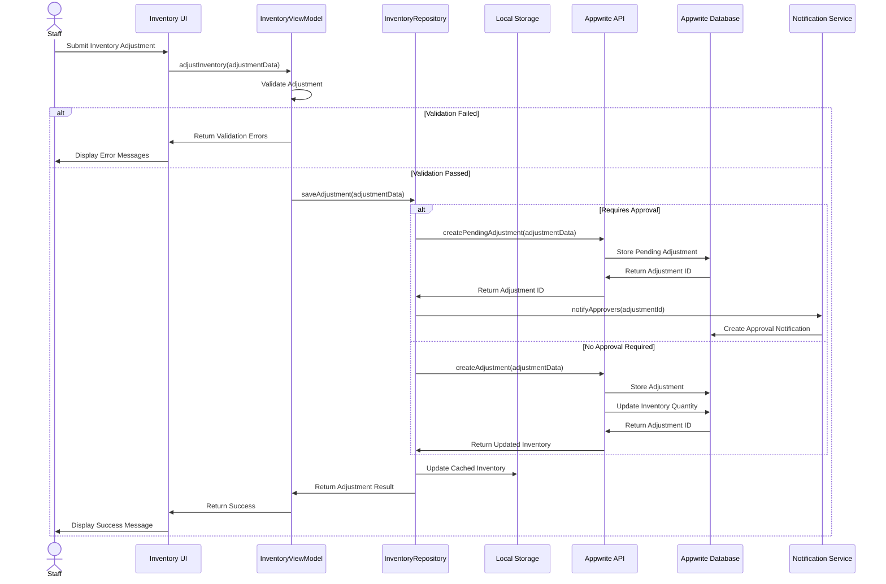
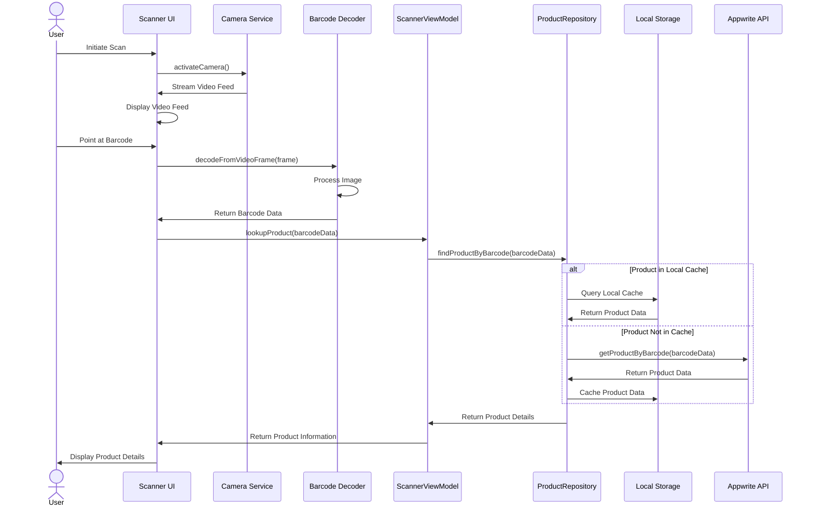
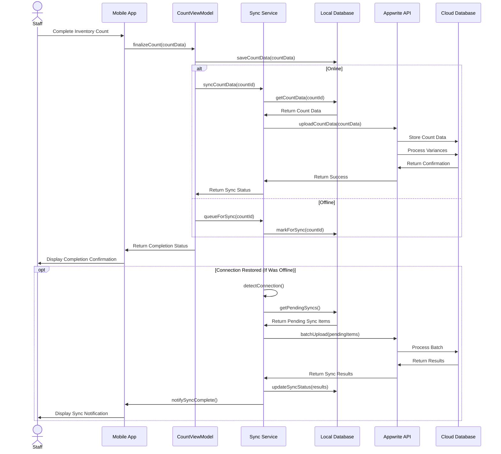
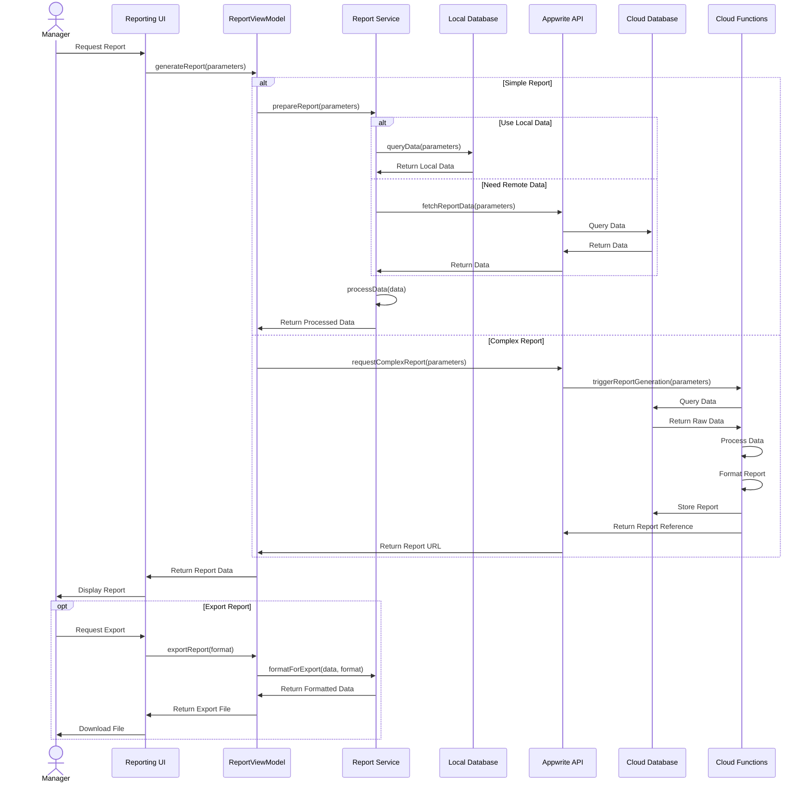
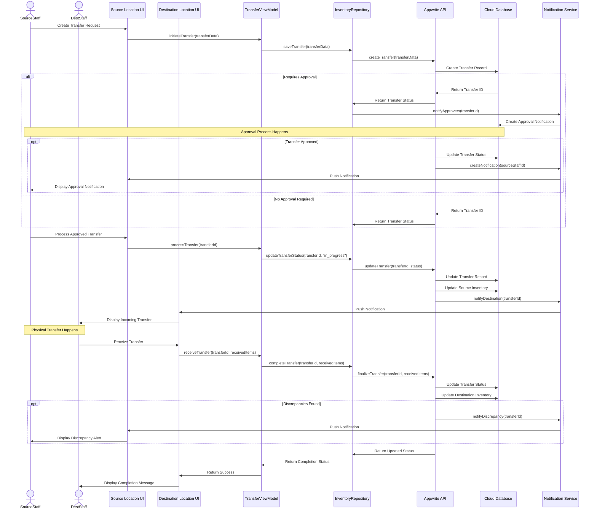

# 6.3 Sequence Diagrams

This section provides sequence diagrams that illustrate the interactions between different components and actors within the Inventory Management Application.

## Authentication Flow

## Product Creation Sequence

## Inventory Adjustment Sequence

## Barcode Scanning Sequence

## Inventory Count Synchronization

## Report Generation Sequence

## Stock Transfer Sequence

