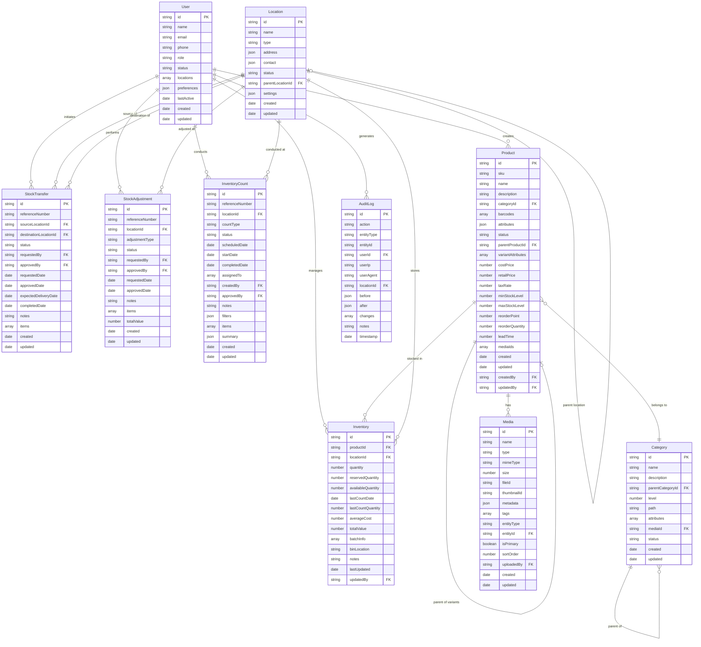

# 6.4 Entity Relationship Diagrams

This section provides Entity Relationship Diagrams (ERDs) that illustrate the data structure and relationships between different entities within the Inventory Management Application.

## Core Entities ERD

## Transaction Entities ERD

## Support Entities ERD

## Local Database ERD

## Data Flow Relationships

These Entity Relationship Diagrams provide a comprehensive visualization of the data architecture within the Inventory Management Application. They illustrate how different entities relate to each other, their key attributes, and the flow of data throughout the system.
